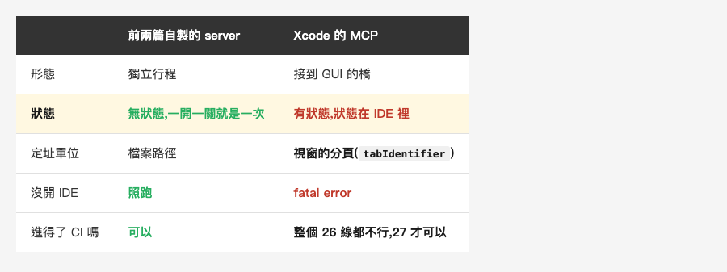
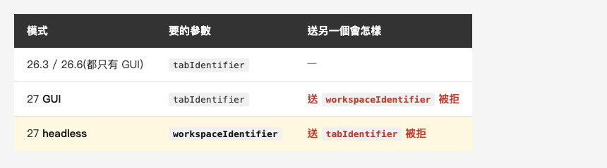
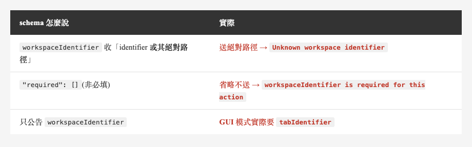
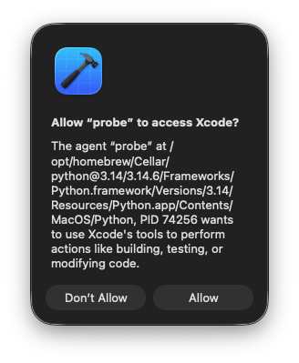
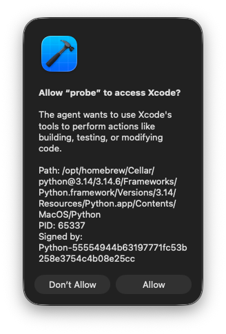
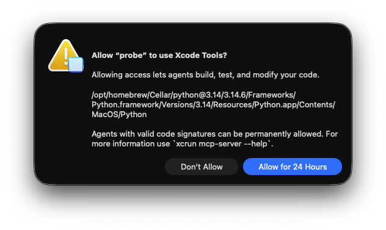
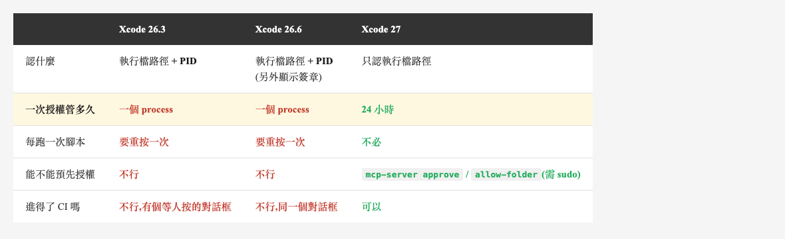
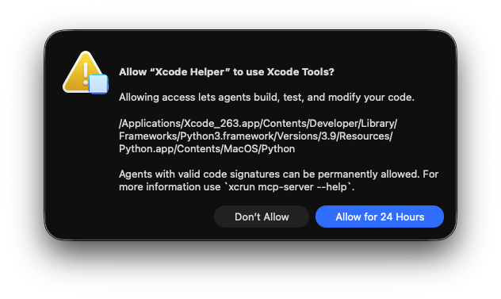
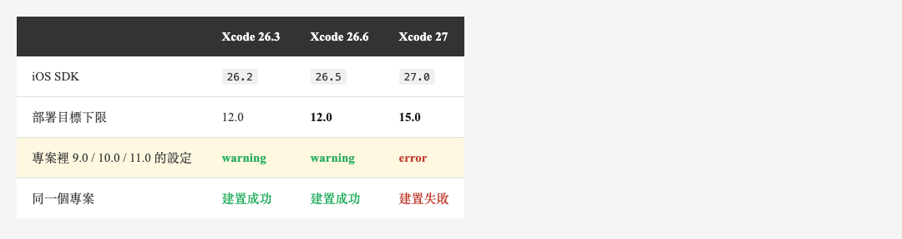

<!-- Tags: Claude Code, MCP, Xcode, iOS, Developer Tools -->

*(在這裡插入封面圖:cover.png)*

<!--
Gemini prompt: A cute Ghibli-inspired soft pastel illustration. A small robot stands in front of a large control panel, reaching for a dropdown switch that is drawn behind a pane of frosted glass it cannot reach through; a chibi engineer on the other side casually flips the same switch. Soft pastel colors (mint, peach, lavender), white background, clean and simple, no text anywhere. 16:9 ratio.
-->

# agent 卡在一個它看不見的下拉選單前面:Xcode MCP 的狀態問題

> 上一篇談 Xcode 內建 MCP 怎麼報告失敗。這篇談它為什麼會失敗——它不是一個 server,是一個接到 IDE 上的橋。而 IDE 裡有一半的狀態,agent 看不到、也改不動。Xcode 27 修好了其中最要命的那一個。

---

## 前言

先講一個我實測時撞到的畫面。

同一支腳本、同一個專案、同一個版本的 Xcode,我跑了兩次。第一次:

```json
BuildProject → {"buildResult":"The build failed…",
                "errors":[{"message":"No Accounts: Add a new account in Accounts settings."},
                          {"message":"No profiles for 'com.example.mainapp' were found…"}]}
```

中間我沒有改任何一行程式碼、沒有動任何設定檔。我只是在 Xcode 的 toolbar 上,把 destination 從實機改成模擬器。第二次:

```json
BuildProject → {"buildResult":"The project built successfully.",
                "elapsedTime":26.10,"errors":[]}
```

**決定 agent 成敗的,是一個人類在 GUI 下拉選單裡留下的選擇。** 而在 Xcode 26.3 上,agent 既讀不到這個選擇,也改不了它——26.3 那 20 支工具裡,沒有任何一支跟 run destination 有關。

[上一篇](https://medium.com/p/d13ae9fabb7a)談的是它怎麼報告失敗。這篇談它為什麼會走到失敗:**這套工具有狀態,而狀態不在 agent 這一側。**

---

## Part 1:它不是 server,是 bridge

這是所有事情的根源,而官方文件用一句話帶過:

> Before prompting an external agent (outside of Xcode), be sure to open your project in Xcode.

`mcpbridge` 對自己的描述是 "STDIO Bridge for Xcode MCP Tools"。它不是一個獨立的 server,是一條走 XPC 連到**活著的 Xcode 行程**的橋。沒開 Xcode,26.3 直接 fatal error:

```
Fatal error: MCP_XCODE_PID environment variable not set
and no running Xcode processes found
```

如果覺得這還不夠明確,證據在工具簽名裡:**26.3 的 20 支工具,有 18 支要求一個 `tabIdentifier` 參數**——例外只有兩支:`XcodeListWindows`,和 `DocumentationSearch`(它是唯一一支跟「你現在開著哪個專案」無關的工具)。26.6 是 21 支裡 19 支,例外一模一樣。它定址的單位不是「專案」,是**「某個 Xcode 視窗的某個分頁」**。

*(在這裡插入圖片:table-arch.png)*

<!--
| | [前兩篇](https://medium.com/@n913239/%E8%87%AA%E5%B7%B1%E5%81%9A%E4%B8%80%E5%80%8B-mcp-server-237-%E8%A1%8C-%E7%AC%AC%E4%B8%80%E6%AC%A1%E8%B7%91%E5%B0%B1%E6%8A%93%E5%88%B0%E6%88%91%E4%B8%89%E5%80%8B%E6%9C%88%E5%89%8D%E6%B4%A9%E6%BC%8F%E7%9A%84%E6%9D%B1%E8%A5%BF-921040a17e7b)自製的 server | Xcode 的 MCP |
|---|---|---|
| 形態 | 獨立行程 | 接到 GUI 的橋 |
| 狀態 | 無狀態,一開一關就是一次 | **有狀態,狀態在 IDE 裡** |
| 定址單位 | 檔案路徑 | **視窗的分頁(`tabIdentifier`)** |
| 沒開 IDE | 照跑 | **fatal error** |
| 進得了 CI 嗎 | 可以 | **整個 26 線都不行,27 才可以** |
-->

上一篇我自己做的那個 MCP server,是一支 Python 腳本,一開一關就是一個 process,沒有任何狀態。**Xcode 的剛好相反,而這個差別會用各種方式咬你。**

---

## Part 2:那個看不見的下拉選單

`BuildProject` 的參數只有兩個:`tabIdentifier`,和一個可選的 `buildForTesting`。

**沒有 destination 參數。**

它用的是 Xcode GUI 當下選著的 run destination。而我打開專案時,上面留著的是一台實機——那是我上次用這個專案時選的。於是 agent 呼叫建置,Xcode 去找開發者帳號與 provisioning profile,失敗。

**agent 完全無從得知這件事。** 錯誤訊息說的是「找不到帳號」和「找不到 profile」,一個合理的 agent 會開始處理簽章問題——去讀 `project.pbxproj`、去查 `DEVELOPMENT_TEAM`、去建議你登入 Apple 帳號。它會走進一條完全正確、也完全沒用的路。

真正的解法是:**把那個下拉選單改成模擬器。** 而 26.3 的工具清單裡:

- 沒有 `XcodeListRunDestinations`
- 沒有 `XcodeSwitchRunDestination`
- `XcodeListWindows` 只回 `tabIdentifier` 和 workspace 路徑,不含 destination

**在 26.3,agent 撞到這件事就只能停在那裡等人。** 而它甚至不知道自己該叫人來。

### 27 把這一格補起來了

先標一下版本:這裡所有關於 27 的觀察,都來自 build `27A5237l`(beta 5)——**27 目前還是 beta**,下面這些行為在正式版可能再變;26 那一側則是正式版,是現在就成立的。

而「26 做不到」不是只有 26.3 的問題。我把 26 線最新的正式版 **26.6(`17F113`)** 也裝起來量過:`xcrun mcp-server` 這支指令**根本不存在**,bundle 裡也找不到 `XcodeService.app`;工具清單是 21 支,`XcodeListRunDestinations` 與 `XcodeSwitchRunDestination` **兩支都沒有**。**headless 與自救能力,是整個 26 正式版線都沒有的東西,不是某一個小版本的疏漏。**

Xcode 27 的工具清單從 26.6 的 21 支跳到 53 支——新增 36 支、拿掉 4 支。新增的絕大多數是往「操作整個 IDE 與裝置」擴張:裝置互動、崩潰遙測、在地化、建置設定。而對這個問題來說,關鍵的是兩支:

```json
XcodeListRunDestinations → 0.0s → 40 個 destination
{"activeDestinationDisplayTitle":"iPhone 17 Pro (27.0)",
 "activeSchemeName":"MainApp",
 "destinations":[{"displayTitle":"iPhone 16 Pro (18.6, …)","group":"Simulators",
                  "isActive":false,"isEligible":true,"osVersion":"18.6",
                  "platformIdentifier":"com.apple.platform.iphonesimulator"}, …]}
```

每一個 destination 都標了 `isActive`(現在選的是哪個)與 `isEligible`(能不能用)。**agent 終於看得到那個下拉選單了。**

而它也改得動:

```json
XcodeSwitchRunDestination({"displayTitle":"iPhone 16 Pro (18.6, …)"})
→ 0.0s → {"message":"Active run destination is now '…' for scheme 'MainApp'."}
```

**這一格的價值,比新增的那 36 支工具加起來還大。** 因為它改變的不是能力範圍,是 agent 撞牆時的行為:從「停住」變成「自救」。

### 一個完整的自救

最漂亮的一次實測是這樣。27 的 headless 模式(Xcode 完全沒開)有它自己的 scheme 狀態,預設選的是 `iPhone 17 Pro (27.0)`。我叫它跑全部測試:

```json
RunAllTests → 63.6s → {"counts":{"passed":0,"failed":0,"notRun":189,"total":189}}
```

189 個測試,一個都沒跑(原因在上一篇:app 在 iOS 27 模擬器上啟動即崩潰)。然後,在同一個 session 裡:

```json
XcodeSwitchRunDestination("iPhone 16 Pro (18.6, …)")  →  0.0s
BuildProject                                          →  7.1s   ✅
RunAllTests                                           →  9.2s   → 163 passed
```

**只換了一個 destination,189 個測試從全滅變成 163 全過。**

在 26.3 與 26.6 上,這三步裡的第一步都不存在。

---

## Part 3:狀態不只一份

destination 只是最戲劇化的那個。實測下來,「同一件事在不同地方有不同答案」出現了四次。

### 一、GUI 與 headless 的狀態是分開的

27 的 headless 跑的不是 Xcode,是一個叫 `XcodeService.app` 的服務。它有自己的 workspace 清單、自己的 active scheme、自己的 destination。

GUI 那邊選的是 `iPhone 16 Pro (18.6)`,headless 這邊是 `iPhone 17 Pro (27.0)`。**兩邊互不知情。** 你在 GUI 裡調好的設定,換到 headless 一個都不算數——而 headless 正是 CI 會用的那個模式。

### 二、參數名也跟著模式變

同一支 `BuildProject`,同一個版本:

*(在這裡插入圖片:table-param.png)*

<!--
| 模式 | 要的參數 | 送另一個會怎樣 |
|---|---|---|
| 26.3 / 26.6(都只有 GUI) | `tabIdentifier` | — |
| 27 **GUI** | `tabIdentifier` | 送 `workspaceIdentifier` 被拒 |
| 27 **headless** | `workspaceIdentifier` | 送 `tabIdentifier` 被拒 |
-->

而我從 headless 抓到的 schema,**只公告了 `workspaceIdentifier`**。

### 三、兩支工具對同一次建置給相反的答案

這一格是在 26.3 GUI 上量的。建置成功後,同一時間問兩支診斷工具:

```json
XcodeListNavigatorIssues → {"issues":[], "totalFound":0}
GetBuildLog(severity=warning) → 43,107 字元,數十個 target 的警告
```

**一支說沒有問題,另一支給了四萬字的問題。**

兩支都沒錯:`XcodeListNavigatorIssues` 反映的是 **Xcode UI 面板當下的狀態**(建置成功後面板被清空了),`GetBuildLog` 讀的是建置紀錄。但對一個 agent 來說,這是兩個名字都像「告訴我哪裡有問題」的工具,回了相反的東西。

**選錯一支,你就以為專案很乾淨。** 順帶一提,27 直接把 `XcodeListNavigatorIssues` 移除了——它是 27 拿掉的四支之一。矛盾消失的方式不是讓兩支對齊,是砍掉其中一支。

### 四、連「你在跟哪一個 Xcode 講話」都是外面決定的

這是我自己踩到的,而且踩得最久。多版本 Xcode 並存時,`xcrun mcpbridge` 預設連的**不是**你呼叫的那個 bundle 裡的 Xcode,是 `xcode-select -p` 指到的那一版。我的 `xcode-select` 指著一個沒有 MCP 的舊版 Xcode,於是:

```json
initialize → {"serverInfo":{"name":"xcode-tools","version":"24952"}}   ← 26.6 的版本號,看起來完全正常
tools/list → (永遠沒有回應)
```

**`initialize` 成功了,而且回了正確的 26.6 版本號。** 但那個版本號是 `mcpbridge` 這支執行檔從自己的 bundle 讀的,跟它實際連到誰無關——我用 27 的 bridge 再測一次,它一樣回自己的 `25280.8`。所以**握手成功、版本正確,完全不代表你接到了你以為的那個 Xcode**。

而接錯的時候,`tools/list` 不回應、不報錯,授權對話框也不跳。我掃過全系統的視窗確認沒有任何對話框,一路懷疑到版本互卡、`IDEAllowUnauthenticatedAgents` 設錯、專案沒開——全都不是。

解法是一個環境變數:

```bash
MCP_XCODE_PID=$(pgrep -f 'Xcode_266.app/Contents/MacOS/Xcode') xcrun mcpbridge
```

設對之後對話框立刻跳出來,`tools/list` 回了 21 支。**而這個變數只寫在 27 的 `mcpbridge --help` 裡,26.6 的 help 完全沒提它——但 26.6 一樣吃。**

這是整篇最乾淨的一個例子:**決定成敗的狀態(`xcode-select` 指向哪裡)不在專案裡、不在 agent 裡,而它答錯的時候,回你的是一個看起來正確的版本號。**

---

## Part 4:schema 對不上四次,錯誤訊息救了三次

實測中我送錯了三次參數,三次都不是我的錯——是 schema 說的跟實際不一樣。

*(在這裡插入圖片:table-schema.png)*

<!--
| schema 怎麼說 | 實際 |
|---|---|
| `workspaceIdentifier` 收「identifier **或其絕對路徑**」 | 送絕對路徑 → `Unknown workspace identifier` |
| `"required": []`(非必填) | 省略不送 → `workspaceIdentifier is required for this action` |
| 只公告 `workspaceIdentifier` | GUI 模式實際要 `tabIdentifier` |
-->

三次都被拒。但三次我都在**下一輪就修好了**,因為錯誤訊息長這樣:

```
Unknown workspace identifier '/Users/you/projects/MainApp/MainApp.xcworkspace'.
Call XcodeListWorkspaces to get the current list of open workspaces and their
identifiers, then retry with a valid workspaceIdentifier.
```

```
Error: workspaceIdentifier is required for this action.
Choose from the following open workspaces, or open one with XcodeOpenWorkspace:
* workspaceIdentifier: workspace-JMfxBofCuD, workspacePath: /Users/you/projects/…
```

**它不只說你錯了,它告訴你該呼叫哪一支工具、然後怎麼重試,還順手把答案附上。**

這件事值得單獨拿出來說,因為它跟直覺相反:

> **schema 不準不致命。錯誤訊息不會教你下一步,才致命。**

一個 agent 面對「參數名錯了」這種問題,只要錯誤訊息夠具體,一輪往返就修好了,成本是幾百個 token。而面對上一篇那種「回你一份假的成功報表」,它連知道自己錯了的機會都沒有。

**寫工具給 agent 用的人,值得把這條記下來:錯誤訊息是 API 的一部分,而且是比 schema 更重要的那部分。**

**但這個優點在同一份 API 裡並不均勻。** 我還撞到第四處參數變化:`RunSomeTests` 的參數形狀在 26.6 就換過一次——26.3 收 `testIdentifiers`,26.6 與 27 改成 `tests:[{targetName, testIdentifier}]`。我照 26.3 的寫法送過去,拿到的是這個:

```json
{"type":"error","data":"The data couldn't be read because it is missing."}
```

**沒說哪個參數錯、沒列出正確格式、也沒告訴我該先呼叫哪一支工具。** 這次我是自己把 schema 抓下來逐欄比對才修好的,不是靠它。

所以上面那條規則要補一句:**錯誤訊息是 API 的一部分,而同一份 API 裡的錯誤訊息品質可以差很多。** 好的那幾支讓我一輪往返就修好,壞的那一支讓我多繞了一圈。

`XcodeSwitchRunDestination` 的 schema 甚至反過來替 agent 想好了——它在 `displayTitle` 的說明裡寫明,這個值可以直接沿用前一支工具的輸出,不必再查一次:

> Round-trips through any of these prior tool outputs without needing a fresh `XcodeListRunDestinations` call.

**這是為 agent 迴圈設計過的細節。** 同一份 API 裡,有這種體貼,也有四處對不上的 schema。

---

## Part 5:授權對話框幫不了你

最後一個狀態問題,不在專案裡,在你和這套工具之間。

第一次連上去,Xcode 會跳一個授權對話框。26.3 長這樣:

*(在這裡插入圖片:dialog-263.png)*


> **Allow "probe" to access Xcode?**
> The agent "probe" at /opt/homebrew/…/Python, **PID 74256** wants to use Xcode's tools
> to perform actions like building, testing, or modifying code.
> [Don't Allow] [Allow]

26.6 長這樣——注意最後多了一行:

*(在這裡插入圖片:dialog-266.png)*


> **Allow "probe" to access Xcode?**
> The agent wants to use Xcode's tools to perform actions like building, testing, or modifying code.
> Path: /opt/homebrew/…/MacOS/Python
> **PID: 65337**
> **Signed by: Python-55554944b63197771fc53b…**
> [Don't Allow] [Allow]

27 換成這樣:

*(在這裡插入圖片:dialog-27.png)*


> **Allow "probe" to use Xcode Tools?**
> Allowing access lets agents build, test, and modify your code.
> /opt/homebrew/…/Python
> Agents with valid code signatures can be permanently allowed.
> [Don't Allow] [**Allow for 24 Hours**]

三個版本的差別是**授權的顆粒度**:

*(在這裡插入圖片:table-auth.png)*

<!--
| | Xcode 26.3 | Xcode 26.6 | Xcode 27 |
|---|---|---|---|
| 認什麼 | 執行檔路徑 **+ PID** | 執行檔路徑 **+ PID**(另外顯示簽章) | 只認執行檔路徑 |
| 一次授權管多久 | **一個 process** | **一個 process** | **24 小時** |
| 每跑一次腳本 | **要重按一次** | **要重按一次** | 不必 |
| 能不能預先授權 | 不行 | 不行 | `mcp-server approve` / `allow-folder`(需 sudo) |
| 進得了 CI 嗎 | **不行,有個等人按的對話框** | **不行,同一個對話框** | 可以 |
-->

26.3 認 PID,所以我連續跑三輪測試就按了三次 Allow——截圖裡的 PID 從 74256 變成 74496 再變成 78403。

**而 26.6 一模一樣。** 我在同一個 Xcode session 裡開三條 client,PID 分別是 65337、65522、65539,**跳了三次對話框、按了三次 Allow**——即使三次的 `Signed by` 欄位一字不差。**簽章它算了、也印出來了,但沒有拿去當授權依據。** 27 的對話框才寫著「有效簽章可以永久允許」。

所以「要人在旁邊按」不是 26.3 的毛病,是**整個 26 正式版線的行為**。**這才是 26 進不了 CI 的真正原因**,不是工具少。

而 27 把它換成了「依執行檔路徑 + 24 小時 + 有效簽章可永久」,再加上 `mcp-server approve` 與 `allow-folder` 這類需要 sudo 的預先授權指令。**從「人在旁邊按」變成「機器可以預先授權」。**

順帶一提,還有一個沒有文件的開關。`com.apple.dt.Xcode` 裡有個 key 叫 `IDEAllowUnauthenticatedAgents`,它存在於 26.3、26.6、27 三個版本的 `IDEIntelligenceChat.framework` 裡。我把它關掉再連一次:`initialize` 照常成功、server 版本照回,**但 `tools/list` 回 0 支工具,而且對話框連跳都沒跳。** 它不是「跳過詢問」的開關,是「**連問都不問,直接不給**」——你會拿到一個握手成功、工具清單卻是空的 server。

### 但這個對話框告訴你的事,不能信

我在 `initialize` 裡把 `clientInfo.name` 填成 `probe`,對話框的標題就寫 `Allow "probe" to…`。

**那個名字是我自己填的字串。** 我改填 `Xcode Helper`,對話框標題就變成 `Allow "Xcode Helper" to use Xcode Tools?`。任何 agent 都能自稱任何名字。

那底下那行執行檔路徑呢?那是唯一由系統填的欄位,聽起來可信。但我第二次實驗只是把腳本改用 `/usr/bin/python3` 執行——那是個 shim,而 `xcode-select` 指向 26.3——於是對話框顯示的路徑變成:

```
/Applications/Xcode_263.app/Contents/Developer/Library/Frameworks/
Python3.framework/Versions/3.9/Resources/Python.app/Contents/MacOS/Python
```

*(在這裡插入圖片:dialog-spoof.png)*


**一個叫「Xcode Helper」、路徑在 Xcode 自己的 app bundle 裡的東西**,看起來無比正當。實際上那是我的腳本。

我不是在示範攻擊,這連攻擊都稱不上——我只是換了一支直譯器。重點是這個對話框能給你的資訊,本質上就不足以判斷「這是不是我要授權的那個 agent」。

**授權一個 MCP agent,和 `npm install` 一個沒聽過的套件,是同一類決定。** [自製 MCP server 那篇](https://medium.com/@n913239/%E8%87%AA%E5%B7%B1%E5%81%9A%E4%B8%80%E5%80%8B-mcp-server-237-%E8%A1%8C-%E7%AC%AC%E4%B8%80%E6%AC%A1%E8%B7%91%E5%B0%B1%E6%8A%93%E5%88%B0%E6%88%91%E4%B8%89%E5%80%8B%E6%9C%88%E5%89%8D%E6%B4%A9%E6%BC%8F%E7%9A%84%E6%9D%B1%E8%A5%BF-921040a17e7b)談 `.mcp.json` 在專案 scope 下會停在「待核准」時,我說那是供應鏈的邊界。這裡是同一條線的另一端:**邊界存在,但站在邊界上的那個守衛,看不清楚來的是誰。**

實務上的意思很簡單:**授權的判斷要在你敲下那個指令的時候做完,不要留給對話框。** 你知道自己剛剛啟動了什麼,對話框不知道。

---

## Part 6:順帶一提,老專案可能根本進不了門

還有一件跟狀態無關、但值得一提的事,因為它影響你要不要升級。

我在 Xcode 27 上第一次建置這個專案,1.55 秒就死了,16 個 error 全部長一樣:

```
The iOS Simulator deployment target 'IPHONEOS_DEPLOYMENT_TARGET' is set to 9.0,
but the range of supported deployment target versions is 15.0 to 27.0.x.
```

*(在這裡插入圖片:table-deploy.png)*

<!--
| | Xcode 26.3 | Xcode 26.6 | Xcode 27 |
|---|---|---|---|
| iOS SDK | 26.2 | 26.5 | **27.0** |
| 部署目標下限 | 12.0 | **12.0** | **15.0** |
| 專案裡 9.0 / 10.0 / 11.0 的設定 | **warning** | **warning** | **error** |
| 同一個專案 | 建置成功 | 建置成功 | **建置失敗** |
-->

同一份 CocoaPods 相依,同一個設定值:**26 放行,27 擋下。**

**注意這條界線的位置跟前面幾條都不一樣。** 假成功修好在 26.6、工具數在 26.6 微幅變動——但部署目標這條線落在 **26 與 27 之間**:26.6 的 SDK(26.5)最低支援值和 26.3 一樣是 `12.0`,27 才跳到 `15.0`。**不是每一個變化都發生在同一個版本上,值得逐條自己量。** 修法是把 38 處 `IPHONEOS_DEPLOYMENT_TARGET` 統一拉到 15.0,改完 27 就建得起來了,headless 也一樣(22.2 秒)。

這件事本身不難修。值得注意的是那個順序:

> **27 給了你 CI 需要的 headless 與預先授權,然後你的老專案在它上面編不起來。**

而愈老的專案,愈需要 agent 幫忙。

---

## 總結

**Xcode 的 MCP 不是一個 server,是一條接到 IDE 上的橋——它有狀態,而狀態不在 agent 那一側。** 這一句話解釋了這篇所有的現象:destination 看不見、GUI 與 headless 各有一套、參數名跟著模式變、兩支診斷工具給相反答案,以及連「你在跟哪一個 Xcode 講話」都由 `xcode-select` 在外面決定。

**26 到 27 最重要的改變,不是新增了 36 支工具,是 agent 從「卡住」變成「能自救」。** `XcodeListRunDestinations` 與 `XcodeSwitchRunDestination` 這兩支,加上把授權從「認 PID、每次都要人按」改成「認路徑、24 小時、可預先核准」——這兩件事合起來,才是「MCP 能不能進 CI」的答案。

**而四處對不上的 schema,有三處在一輪往返內就修好了**,因為錯誤訊息會直接告訴你下一步該呼叫哪支工具;剩下那一處只回「資料讀不到」,我得自己把 schema 抓下來逐欄比對。這跟上一篇那個「回一份假的成功報表」形成很乾淨的對照:**明確的錯誤便宜,安靜的錯誤昂貴**——而這兩種,同一份 API 裡都有。

最後一句時效提醒:**27 這些改進還在 beta 5(`27A5237l`)**,正式版出來前都可能再動;而 26 那些限制是正式版的行為——我在 26.3 與 26.6 兩個正式版上都量過,它不會自己消失。

如果要從這兩篇挑一件事帶走:**接一套 agent 工具的時候,先去弄清楚它有哪些狀態是你看不到的,以及它失敗的時候會怎麼講。** 能做什麼,反而是最不需要擔心的那部分。

---

## 參考資料

- [Xcode 官方文件 — Giving external agents access to Xcode](https://developer.apple.com/documentation/xcode/giving-external-agents-access-to-xcode) — 「用之前請先在 Xcode 開好專案」那句話的出處
- [Model Context Protocol 官方站](https://modelcontextprotocol.io/) — 協定規格與 stdio transport
- [fatbobman — Xcode 26.3 與 Claude](https://fatbobman.com/en/posts/xcode-263-claude/) — 設定與功能的完整介紹
- [XcodeBuildMCP](https://github.com/cameroncooke/XcodeBuildMCP) — 走 `xcodebuild` CLI 的第三方替代方案,無狀態、不需開 Xcode
- 系列前篇:[Xcode 內建 MCP 實測:它回報 163 個測試全過,而專案根本編不起來](https://medium.com/p/d13ae9fabb7a) — 同一套工具怎麼報告失敗,以及那份假的 163 passed 報表
- 系列前篇:[自己做一個 MCP server:237 行,第一次跑就抓到我三個月前洩漏的東西](https://medium.com/@n913239/%E8%87%AA%E5%B7%B1%E5%81%9A%E4%B8%80%E5%80%8B-mcp-server-237-%E8%A1%8C-%E7%AC%AC%E4%B8%80%E6%AC%A1%E8%B7%91%E5%B0%B1%E6%8A%93%E5%88%B0%E6%88%91%E4%B8%89%E5%80%8B%E6%9C%88%E5%89%8D%E6%B4%A9%E6%BC%8F%E7%9A%84%E6%9D%B1%E8%A5%BF-921040a17e7b) — 無狀態 stdio server 的對照組,以及 `.mcp.json` 待核准那條供應鏈邊界
