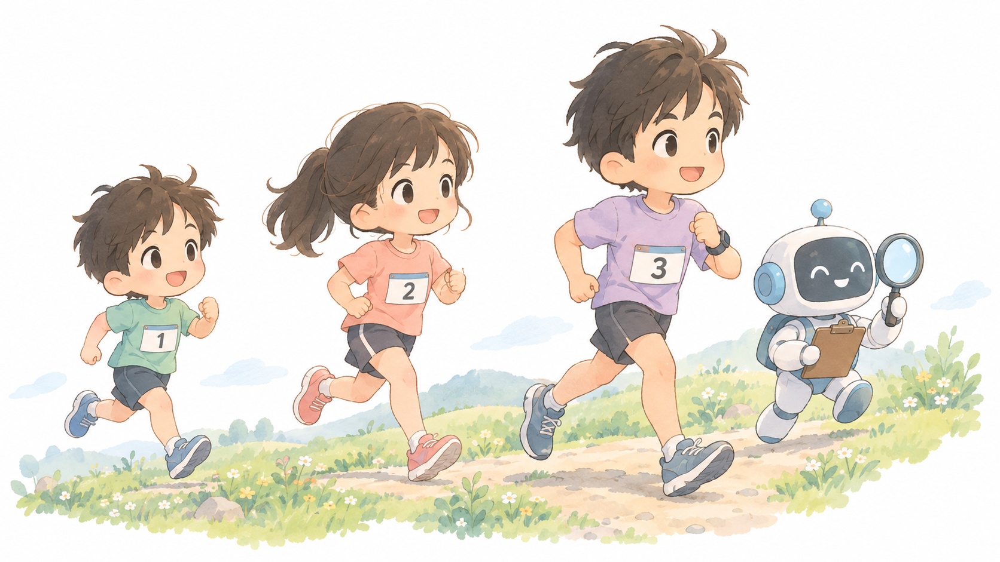
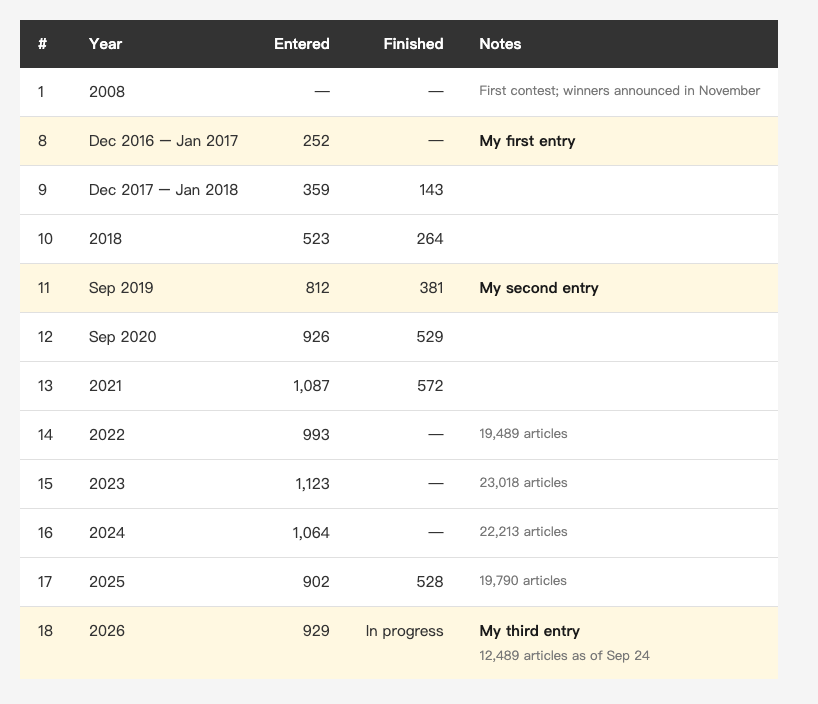
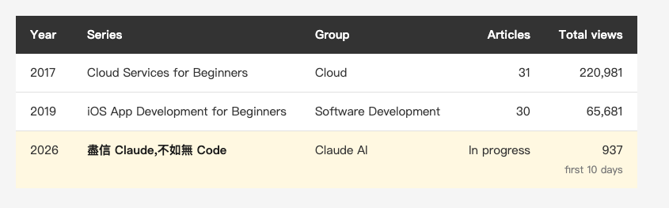

<!-- Tags: iThome Ironman, Claude Code, AI, Writing, Software Development -->

*(Insert cover image here: cover.png)*

<!--
Gemini prompt: A cute Ghibli-inspired soft pastel illustration. Three chibi runners in marathon bibs labeled only with small numbers stand in a row on a gentle hill path, each a little older than the last; the third runner is accompanied by a small friendly robot holding a clipboard and a magnifying glass. Soft pastel colors (mint, peach, lavender), white background, clean and simple, no text anywhere. 16:9 ratio.
-->

# Nine Years, Three Ironman Contests: From Setting Up Cloud Servers to Not Trusting AI Blindly

> No code in this one. It covers three things: what the iThome Ironman contest is, what my first two entries taught me, and how I used AI to plan this year's entry.

---

## Introduction

I'm in the iThome Ironman contest for the third time, and today is day 11. I entered in 2017 and 2019 and finished both. This year's series is called **[盡信 Claude,不如無 Code — 心法與全端實戰](https://ithelp.ithome.com.tw/users/20103790/ironman/9685)**. It started on September 15 and ends on October 14.

This Medium series has covered Claude Code for the past three months, and the contest series continues that work. The first 20 days are about how I work with AI. The last 10 days use that workflow to build a full-stack project from scratch.

Most readers outside Taiwan have never heard of this contest, so I'll start there.

---

## Part 1: What the Ironman Contest Is

The Ironman contest is an annual writing contest run by iT Help (iT 邦幫忙), the developer community of the Taiwanese IT publication iThome. The core rule: **publish one technical article every day for 30 days in a row. Miss a day and you're out.** You can't post late, and you can't publish all 30 at once.

The first contest ran in 2008. This is the 18th. Here is how it has grown:

*(Insert image here: table-history-en.png)*

<!--
| # | Year | Entered | Finished | Notes |
|---|---|---|---|---|
| 1 | 2008 | — | — | First contest; winners announced in November |
| 8 | Dec 2016 – Jan 2017 | 252 | — | My first entry |
| 9 | Dec 2017 – Jan 2018 | 359 | 143 | |
| 10 | 2018 | 523 | 264 | |
| 11 | Sep 2019 | 812 | 381 | My second entry |
| 12 | Sep 2020 | 926 | 529 | |
| 13 | 2021 | 1,087 | 572 | |
| 14 | 2022 | 993 | — | 19,489 articles |
| 15 | 2023 | 1,123 | — | 23,018 articles |
| 16 | 2024 | 1,064 | — | 22,213 articles |
| 17 | 2025 | 902 | 528 | 19,790 articles |
| 18 | 2026 | 929 | In progress | 12,489 articles as of Sep 24; my third entry |
-->

The numbers come from iThome's page for each contest (checked on 2026-09-24). The "Entered" column counts different things in different years: series entries for the 8th to 11th and the 13th, registered people for the 12th, and participants from the 14th on. "Finished" is always people. So read the trend rather than subtracting year from year. The trend is clear enough: from a couple of hundred entries to around a thousand people a year. **In the contests that published finisher counts, roughly 40 to 60 percent of participants didn't make it to day 30.**

A few things readers outside Taiwan might wonder about:

- **Topic groups:** Each writer picks a topic group. This year there are more than a dozen, including Claude AI, Vibe Coding, Kubernetes, Security, and Software Development. Each group has its own winner and runners-up. There is also a Self-Challenge group with no judging, where finishing is the goal.
- **What the judges look at:** Topic, structure, content, and writing. Page views don't count.
- **Teams:** Three or more people can form a team, and the team only succeeds if every member finishes. So if I miss a day this year, I take the whole team down with me.
- **Books:** Since 2020, the publisher DrMaster (博碩文化) has worked with the contest to turn finished series into books. The count is now close to 150 technical books in Traditional Chinese.

Finishers get the "Ironman" title and a certificate. Plenty of engineers in Taiwan list it on their résumé, and it counts as real experience when job hunting.

---

## Part 2: What My First Two Entries Taught Me

*(Insert image here: table-three-en.png)*

<!--
| Year | Series | Group | Articles | Total views |
|---|---|---|---|---|
| 2017 | Cloud Services for Beginners | Cloud | 31 | 220,981 |
| 2019 | iOS App Development for Beginners | Software Development | 30 | 65,681 |
| 2026 | 盡信 Claude,不如無 Code | Claude AI | In progress | 937 (first 10 days) |
-->

One caveat first: the 2017 and 2019 numbers have been adding up for seven to nine years (checked on 2026-08-22), and this year's cover only ten days (checked on 2026-09-24), **so the sizes can't be compared directly**. But years of long-tail traffic are useful for one thing: they show which articles people actually needed.

Looking back, three things stand out.

**First, most of the most-read articles solved a specific problem.** In 2017 the top ones were "Using database replication for off-site backup" at 19,402 views and "Setting up DNS with Route 53" at 15,741. 2019 was the same. The best were "Testing on a real device" at 6,176 and "Facebook login" at 5,478. The worst were concept introductions like "Booleans and strings" and "Control flow," at around 1,100 each. Within one series, titles about a specific problem got about five times the views of concept introductions.

**Second, the last article matters.** The most-read article of 2017 was the last one in the series, the "Afterword," with 21,986 views.

**Third, don't split one topic into a serial.** In 2019 I split "To-do list" into seven parts, (0) through (6). Views dropped with each one, and part 6 hit 888, the lowest in the series. In 2017 I also split some articles into two or three parts, but each part solved its own problem, and those didn't show the same decline.

I wrote all three into this year's plan before the contest started. Titles name the problem an article solves, not its topic. The last article gets treated as a main piece, and I'll write an afterword once the contest is over. When one topic runs across several days, each article needs its own finding and conclusion, with no "(1)", "(2)" numbering in the title.

---

## Part 3: Letting AI Help Me Plan

I started planning in late August and did almost all of it with Claude Code. The work fell into four kinds.

**1. Checking what others in my group were writing.** The sign-up list is public. Claude Code went through the title and published articles of every series in the Claude AI group and found three gaps in the group at the time: nobody was writing about iOS, nobody was working at the protocol level, and nobody was testing on an old project with years of history behind it.

**2. Looking at how traffic behaves over a 30-day series.** One series in my group, which builds a tool from scratch, went from 322 views on day 1 to 76 on day 20, a 76 percent drop. It bounced back only twice: once for an article whose title said something had gone badly wrong, and once for an article comparing the AI-built version against a hand-written one. **None of the "I built this feature" articles bounced back.** So I set myself a rule: every article needs at least one number, one pass/fail result, or one before-and-after comparison.

**3. Finding holes in my own plan.** I had a different model review the whole plan from start to finish. It found three mistakes. One of them I had made up together with the AI that helped me write the plan. The outline had a column claiming every article in the first half would be used in the second half. When we checked each row, several had no real use at all. The column was there to make the structure look tidy. I deleted it and kept only the links that were real.

**4. Choosing the title.** I changed it four times. One version was a play on a line from the Tang poet Du Fu, built around the character 編, which means both "compile" and "make things up." I liked the double meaning. The AI pointed out twice that the original line is praise, so readers would take the title as flattery at first glance, and the first article would need three paragraphs to turn that around. I kept my version both times. I only switched when it suggested a line from Mencius instead: "If you believe everything in books, you are better off without books." My version swaps books for Claude and code, and it needs no explanation.

Of these four, **the most useful parts were the times the AI pushed back on me**, more than the times it wrote for me. It found the data, the holes, and the counterexamples. Whether to act on them was my call every time.

---

## Part 4: The Next 20 Days

Days 11 to 20 finish the workflow: how to decide whether a skill you wrote is worth keeping, turning de-identification into a checking tool, and how connecting an MCP server works in practice. Then a local model on a Mac mini writes tests, and mutation testing checks whether those tests are real. Finally, OpenSpec breaks down a requirement I had already broken down by hand, and I compare the two.

Days 21 to 30 build an event sign-up system from scratch: an iOS app in SwiftUI, a backend on Cloudflare Workers and D1, and a mobile web page, with one API contract serving both front ends. **There are seven rules, and each one is checked by a machine.** Some are CI tests, one is a fuzz test with 20,000 cases, and one is a load test where a reservation expires, another user grabs the seat, and the original user confirms, all at the same moment. The code is public: [event-signup-lab](https://github.com/n913239/event-signup-lab).

The contest is still running, so for now this section only lists the topics.

---

## Summary

Nine years and three contests. The question changed from "how do I move services to the cloud" and "how do I build an app from scratch" to "how do I check code that AI wrote."

What I learned in 2017 still holds: readers want answers to specific problems. What I learned this year is that **the most valuable AI during planning is the one that argues with you.**

If you read Chinese, you can follow the series on iThome, one article a day until October 14.

---

## References

- [盡信 Claude,不如無 Code — 心法與全端實戰](https://ithelp.ithome.com.tw/users/20103790/ironman/9685) — the 2026 series, in progress (Chinese)
- [iOS App 實作開發新手村 (iOS App Development for Beginners)](https://ithelp.ithome.com.tw/users/20103790/ironman/2906) — 2019, finished (Chinese)
- [雲端服務新手村 (Cloud Services for Beginners)](https://ithelp.ithome.com.tw/users/20103790/ironman/1215) — 2017, finished (Chinese)
- [2026 iThome Ironman contest page](https://ithelp.ithome.com.tw/2026ironman/event) — rules, groups, and the DrMaster publishing program (Chinese)
- [Winners of the first iT Help Ironman contest](https://ithelp.ithome.com.tw/articles/10014292) — announced 2008-11-21 (Chinese)
- [Rules of the 12th iT Help Ironman contest](https://ithelp.ithome.com.tw/2020-12th-ironman/rules) — entry and finisher counts for 2020 (Chinese)
- [event-signup-lab](https://github.com/n913239/event-signup-lab) — source code for the full-stack project in the last 10 days (MIT)
