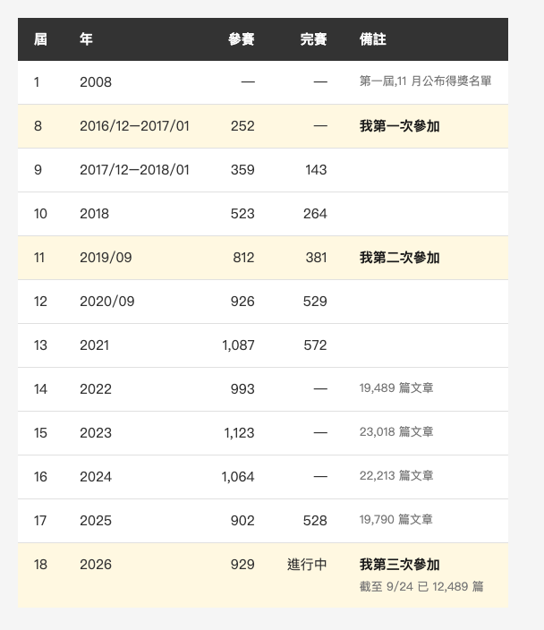
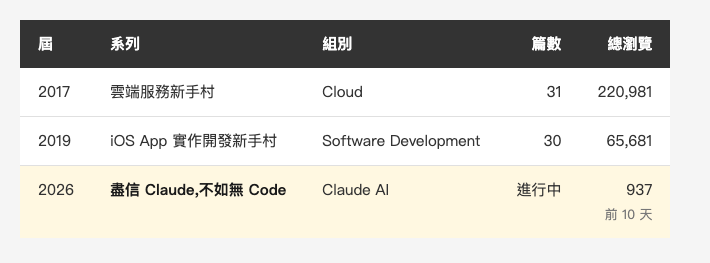

<!-- Tags: iThome鐵人賽, Claude Code, AI, Writing, Software Development -->

*(在這裡插入封面圖:cover.png)*

<!--
Gemini prompt: A cute Ghibli-inspired soft pastel illustration. Three chibi runners in marathon bibs labeled only with small numbers stand in a row on a gentle hill path, each a little older than the last; the third runner is accompanied by a small friendly robot holding a clipboard and a magnifying glass. Soft pastel colors (mint, peach, lavender), white background, clean and simple, no text anywhere. 16:9 ratio.
-->

# 九年、三屆鐵人賽:從教人開雲端主機,到教人別全信 AI

> 這篇不談技術,談三件事:鐵人賽是什麼、前兩次參賽留下的教訓,以及這次怎麼讓 AI 幫我規劃。

---

## 前言

我第三次參加 iThome 鐵人賽,今天是第 11 天。前兩次是 2017 和 2019,兩次都完賽。今年的系列叫 **[盡信 Claude,不如無 Code — 心法與全端實戰](https://ithelp.ithome.com.tw/users/20103790/ironman/9685)**,9/15 開賽、10/14 完賽。

這個 Medium 系列過去三個月都在寫 Claude Code,今年的鐵人賽是同一件事的延伸:前 20 天談怎麼跟 AI 一起工作,後 10 天拿這套方法從零做一個全端專案。

對台灣以外的讀者來說,這個比賽可能比較陌生,所以先從它是什麼講起。

---

## Part 1:鐵人賽是什麼

鐵人賽是台灣 IT 媒體 iThome 旗下技術社群「iT 邦幫忙」每年舉辦的寫作比賽。規則的核心只有一條:**連續 30 天,每天發一篇技術文章,中斷一天就算失敗。** 不能補發,也不能把 30 篇提前一次貼完。

第一屆在 2008 年。十八年下來,規模長這樣:

*(在這裡插入圖片:table-history.png)*

<!--
| 屆 | 年 | 參賽 | 完賽 | 備註 |
|---|---|---|---|---|
| 1 | 2008 | — | — | 第一屆,11 月公布得獎名單 |
| 8 | 2016/12–2017/01 | 252 | — | 我第一次參加 |
| 9 | 2017/12–2018/01 | 359 | 143 | |
| 10 | 2018 | 523 | 264 | |
| 11 | 2019/09 | 812 | 381 | 我第二次參加 |
| 12 | 2020/09 | 926 | 529 | |
| 13 | 2021 | 1,087 | 572 | |
| 14 | 2022 | 993 | — | 19,489 篇文章 |
| 15 | 2023 | 1,123 | — | 23,018 篇文章 |
| 16 | 2024 | 1,064 | — | 22,213 篇文章 |
| 17 | 2025 | 902 | 528 | 19,790 篇文章 |
| 18 | 2026 | 929 | 進行中 | 截至 9/24 已 12,489 篇,我第三次參加 |
-->

數字來自 iThome 各屆的賽事頁面(2026-09-24 查)。「參賽」一欄的單位各屆不同:第 8–11 屆與第 13 屆算的是參賽組數,第 12 屆算報名人數,第 14 屆起算選手數;「完賽」都是人數。所以只能看趨勢,不要逐年相減。趨勢很清楚:從兩百多組長到每年一千人上下;**在有公布完賽數字的屆次,大約四到六成的參賽者沒有撐完 30 天。**

幾個台灣以外的讀者可能會好奇的地方:

- **主題分組:** 參賽者要選一個主題組,今年有 Claude AI、Vibe Coding、Kubernetes、Security、Software Development 等十幾組。每組各自評出冠軍與優選,另外有不參加評比、只求完賽的「自我挑戰」組。
- **評審看什麼:** 主題、結構、內容、表達。流量不算分。
- **組隊:** 三人以上可以組隊,全隊都完賽才算團隊挑戰成功。所以今年我斷一天,拖下水的是整隊。
- **出書:** 2020 年起,出版社博碩文化和鐵人賽合作,把完賽的系列改寫成書,到今年累積將近 150 本繁體中文技術書。

完賽的人會拿到「鐵人」的稱號和完賽證明,不少台灣工程師會把它寫進履歷,求職時是一項實際的經歷。

---

## Part 2:前兩次留下的教訓

*(在這裡插入圖片:table-three.png)*

<!--
| 屆 | 系列 | 組別 | 篇數 | 總瀏覽 |
|---|---|---|---|---|
| 2017 | 雲端服務新手村 | Cloud | 31 | 220,981 |
| 2019 | iOS App 實作開發新手村 | Software Development | 30 | 65,681 |
| 2026 | 盡信 Claude,不如無 Code | Claude AI | 進行中 | 937(前 10 天) |
-->

先說清楚:2017、2019 的數字是累積了七到九年的結果(2026-08-22 查),今年只有 10 天(2026-09-24 查),**不能直接比大小**。但九年的長尾有一個好處:它會告訴你哪些文章真的有人需要。

回頭看,有三件事很清楚。

**第一,流量高的多半是具體問題。** 2017 的前幾名是「使用資料庫複寫功能來達到異地備援」19,402、「透過 Route 53 設定 DNS」15,741。2019 也一樣:最高的是「實機測試」6,176、「第三方登入－臉書」5,478,最低的是「布林與字串介紹」「流程控制」這類概念介紹,都在 1,100 上下。同一個系列裡,直接對應具體問題的標題,和偏向概念介紹的標題,流量差了大約五倍。

**第二,收尾篇不能隨便寫。** 2017 的流量第一名,反而是最後那篇「後記」,21,986。

**第三,同一個主題不要拆成連載。** 2019 我把「待辦清單」拆成 (0) 到 (6) 連續七篇,瀏覽數一路往下掉,到第七篇只剩 888,是全系列最低。2017 也拆過上下篇,但每一篇都是一個能獨立解決的問題,就沒有出現同樣的下滑。

這三條我在今年開賽前就寫進規劃裡了:標題寫成要解決的問題,不寫主題;最後一篇當主打篇來寫,完賽後再補一篇後記;同一個主題分好幾天寫時,每篇都要有自己的發現和結論,不把標題寫成(一)(二)。

---

## Part 3:這次先讓 AI 幫我規劃

今年的規劃從 8 月下旬開始,幾乎全程是跟 Claude Code 一起做的。我讓它做的事情,大概分四類。

**一、看同組的人在寫什麼。** 報名名單是公開的。它把 Claude AI 組每個系列的題目和已發文章都掃過一遍,整理出三個當時在這個組裡還沒人碰的空白:沒有人寫 iOS、沒有人做到協定層、沒有人拿有歷史包袱的舊專案來測。

**二、看連續連載的流量長什麼樣子。** 同組有一個「從零打造一個工具」的系列,Day 1 是 322 次瀏覽,到 Day 20 剩 76,下降約 76%。中間只有兩次反彈:一篇的標題直接寫著「出現大trouble」,另一篇是在比對 AI 做的版本和手刻版本有沒有偏差。**「我做了某個功能」的文章沒有一篇反彈。** 所以我給自己訂了一條規則:每一篇至少要有一個數字、一次紅綠燈、或一個前後對照。

**三、找我自己計畫裡的漏洞。** 我換了另一個模型,把整份規劃從頭到尾審一遍。它抓到三個錯,其中一個還是我和當時幫我寫規劃的 AI 一起編出來的:大綱裡有一欄寫著「前半的每一篇都會在後半用到」,逐條檢查之後,有好幾篇根本用不到,那一欄是為了讓結構好看硬湊的。那一欄最後整個拿掉,只留真的有因果關係的幾條。

**四、改標題。** 改了四次。中間一版是「此 Code 只應 Claude 有,人間難得幾回編」,我很喜歡「編」同時是編譯和編造的雙關,但 AI 提醒我兩次:這句原本是讚美,讀者第一眼會讀成吹捧,要靠第一篇文章花三段解釋才轉得回來。我兩次都沒改,直到它提出孟子的「盡信書,不如無書」作為替代方案,我才換掉,因為這句不用解釋。

這四件事裡,**最有用的都是 AI 在反駁我**,不是在幫我寫。找資料、找漏洞、找反例是它做的;要不要採用,每一次都是我決定。

---

## Part 4:接下來 20 天

Day 11 到 20 把工作流收尾:skill 寫完怎麼判斷該不該留、去識別化怎麼做成檢查工具、MCP 的實際接法。接著讓 Mac mini 上的本地模型寫測試,再用突變測試驗它是不是假的,最後讓 OpenSpec 拆一份我手工拆過的需求,對照兩邊差在哪。

Day 21 到 30 從零做活動報名系統:SwiftUI 的 iOS App、Cloudflare Workers + D1 的後端、一個手機網頁,一份 API 契約餵兩個前端。**七條規則,每一條都有機器當裁判**,有的是 CI 測試,有的是 20,000 組 fuzz,有的是「保留過期、別人搶位、原本的人確認」三件事同時發生的壓測。程式碼是公開的:[event-signup-lab](https://github.com/n913239/event-signup-lab)。

因為比賽還在進行中,這裡先說到題目內容。

---

## 總結

九年、三屆,題目從「怎麼把服務搬上雲」、「怎麼從零寫一支 App」,變成「怎麼驗 AI 寫的 code」。

題目換了,2017 學到的那件事沒變:讀者要的是具體問題的答案。今年多學到的是,**規劃時最有價值的 AI,是會反駁你的那個**。

如果你讀中文,歡迎到 iThome 追蹤這個系列,每天一篇,到 10/14。

---

## 參考資料

- [盡信 Claude,不如無 Code — 心法與全端實戰](https://ithelp.ithome.com.tw/users/20103790/ironman/9685) — 2026 鐵人賽,本系列,進行中
- [iOS App 實作開發新手村](https://ithelp.ithome.com.tw/users/20103790/ironman/2906) — 2019 鐵人賽,完賽
- [雲端服務新手村](https://ithelp.ithome.com.tw/users/20103790/ironman/1215) — 2017 鐵人賽,完賽
- [2026 iThome 鐵人賽活動頁](https://ithelp.ithome.com.tw/2026ironman/event) — 規則、組別,以及博碩文化出版合作
- [第一屆 iT 邦幫忙鐵人賽得獎名單](https://ithelp.ithome.com.tw/articles/10014292) — 2008-11-21 公布
- [第 12 屆 iT 邦幫忙鐵人賽規則](https://ithelp.ithome.com.tw/2020-12th-ironman/rules) — 2020 年的參賽與完賽人數
- [event-signup-lab](https://github.com/n913239/event-signup-lab) — 後半 10 天的全端專案原始碼(MIT)
