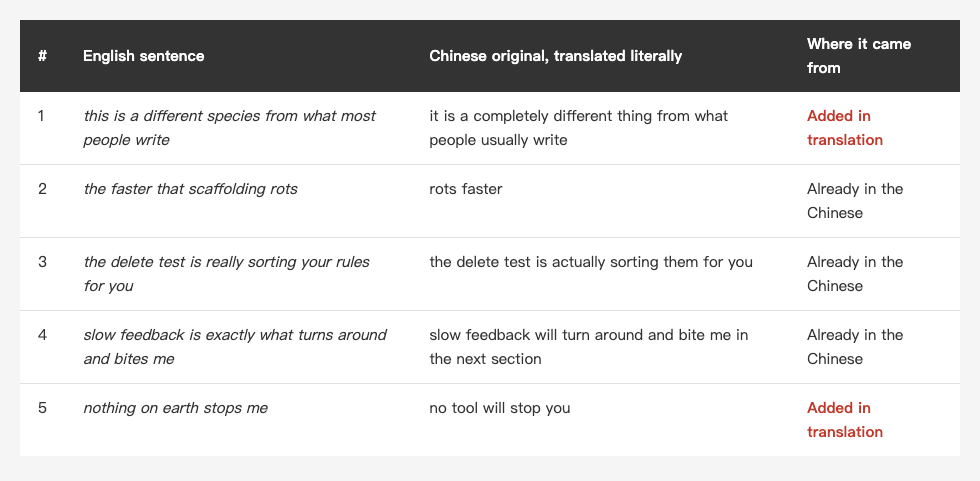
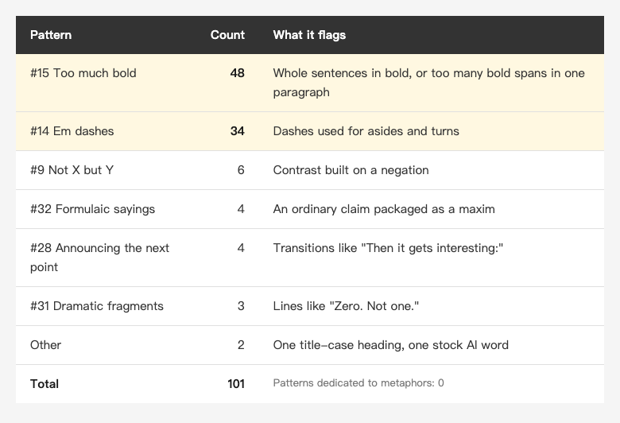
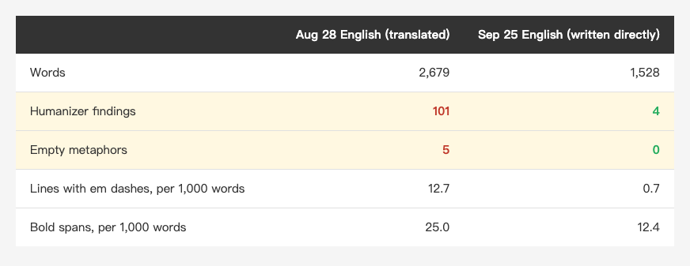

<!-- Tags: Claude Code, AI, Writing, Humanizer, Translation -->

*(Insert cover image here: cover.png)*

<!--
Gemini prompt: A cute Ghibli-inspired soft pastel illustration. A chibi writer sits at a desk with a printed article, holding a red pen; beside the desk a friendly robot holds a large magnifying glass over the page, but it is examining the punctuation marks while a few small decorative flowers growing out of the text lines go unnoticed behind it. Soft pastel colors (mint, peach, lavender), white background, clean and simple, no text anywhere. 16:9 ratio.
-->

# Can Humanizer Polish Your Writing? 80% of Its 101 Findings Were Bold Text and Em Dashes

> I ran humanizer, a popular tool for spotting AI writing patterns, on an English article I had translated with AI help, had a separate AI edit the same piece independently, and compared what each one found.

---

## Introduction

The English version of [Apple Ships a CLAUDE.md](https://medium.com/@n913239/apple-ships-a-claude-md-91-lines-not-one-wasted-what-about-yours-e925cfb65448) was picked up by Medium about ten days after I published it. It got 47K presentations and 15.8K views, 67 percent of those views read for more than 30 seconds, and it brought a net 48 new followers.

The English versions in this series are translated from my Chinese originals with AI help. After the promotion, some comments said it read like AI. The most specific one said the English was full of metaphors that sound good but add no information.

"Sounds like AI" is a feeling, and you can't edit a feeling. The fix people recommend most is humanizer, a Claude Code skill that flags AI writing patterns and can rewrite them. What I wanted to know: if you use it to polish an article, does it change the things that actually need changing?

---

## Part 1: Turning "Sounds Like AI" into Something Countable

"Sounds like AI" is hard to measure, but metaphors that sound good and mean nothing can be counted.

I asked a separate AI to act as an English copy editor. I gave it no AI-writing checklist, only its own editorial judgment. Its job was to find every sentence in the English article that used a metaphor, personification, or aphorism, and sort each one into three groups: figurative wording with a real claim underneath, figurative wording with nothing left once you remove it, and borderline.

It found 34 figurative sentences. **27 carried a real claim**, 2 were borderline, and **5 were empty**.

A sentence that carries a claim looks like "a tool blocks you afterwards; `CLAUDE.md` keeps you off that road in the first place." The road is a metaphor, but underneath it is a checkable point about prevention versus blocking after the fact. The five empty ones have nothing left once the image is gone:

*(Insert image here: table-empty-en.png)*

<!--
| # | English sentence | Chinese original, translated literally | Where it came from |
|---|---|---|---|
| 1 | this is a different species from what most people write | it is a completely different thing from what people usually write | Added in translation |
| 2 | the faster that scaffolding rots | rots faster | Already in the Chinese |
| 3 | the delete test is really sorting your rules for you | the delete test is actually sorting them for you | Already in the Chinese |
| 4 | slow feedback is exactly what turns around and bites me | slow feedback will turn around and bite me in the next section | Already in the Chinese |
| 5 | nothing on earth stops me | no tool will stop you | Added in translation |
-->

Five out of 34 is fewer than I expected. The problem is real, but it sits in a handful of sentences, not across the whole piece.

---

## Part 2: I Wrote Three of the Five Myself

I assumed the translation was to blame. After comparing each sentence with the Chinese original, **only 2 of the 5 were introduced by the translation.**

- "It is a completely different thing from what people usually write" is a plain sentence in Chinese. In English it became "a different species."
- "No tool will stop you" is also plain. In English it became "nothing on earth stops me."

The other three, "rots," "sorting your rules for you," and "turns around and bites me," are in my Chinese original. They read naturally in Chinese because those words are common in Chinese technical writing. Translated directly, they became sentences that sound good and say nothing.

So fixing the translation is not enough. Before a figurative sentence goes into English, I now ask one question: once the image is removed, what fact is left? If nothing is left, the English version states the fact instead.

---

## Part 3: What Humanizer Found

[humanizer](https://github.com/blader/humanizer) is a Claude Code skill with 51.7K stars on GitHub, and its Chinese port has another 18K. It turns the Wikipedia editors' list of "signs of AI writing" into 35 patterns, from inflated claims of importance, sales language, and vague sources to em dashes, bold text, and "not X but Y" constructions.

I ran it in diagnosis-only mode on the same English article. It reported 101 findings:

*(Insert image here: table-patterns-en.png)*

<!--
| Pattern | Count | What it flags |
|---|---:|---|
| #15 Too much bold | 48 | Whole sentences in bold, or too many bold spans in one paragraph |
| #14 Em dashes | 34 | Dashes used for asides and turns |
| #9 Not X but Y | 6 | Contrast built on a negation |
| #32 Formulaic sayings | 4 | An ordinary claim packaged as a maxim |
| #28 Announcing the next point | 4 | Transitions like "Then it gets interesting:" |
| #31 Dramatic fragments | 3 | Lines like "Zero. Not one." |
| Other | 2 | One title-case heading, one stock AI word |
-->

**About 80 percent is bold text and em dashes.** The categories it is best at, such as sales language, vague sources, filler, and stock AI vocabulary, came back close to zero. Its own summary said the piece is full of specific numbers, named sources, and personal detail, and does not read like typical AI output.

Then I checked one more thing. **None of the 35 patterns is about metaphors.** The word "figurative" only appears as a note inside two word lists. The closest patterns are formulaic sayings and pretending to reveal a deeper truth.

---

## Part 4: Checking the Answers

I compared the five empty metaphors from Part 1 with humanizer's 101 findings:

- **Only sentence 1 was caught**, rated weak, as a formulaic saying.
- The lines holding the other four were all flagged, but for **an em dash or bold text on the same line**, not for the metaphor.

Put another way: of the five sentences that needed fixing, it caught one. Of its 101 findings, one was about an empty metaphor.

Its rewrite samples showed the same thing. I asked it to rewrite the three densest paragraphs:

- "keeps you off that road in the first place" became a plain sentence. In Part 1, this was a metaphor **that carried a claim**.
- "the delete test is really sorting your rules for you" stayed. In Part 1, this was one of the **empty** ones.

It removed a useful metaphor and kept an empty one. That is not a bug. It was never judging whether a metaphor has content; it was reducing the density of dashes and bold text, and whatever metaphors changed along the way changed by accident.

This gap is not specific to humanizer. Last week I ran [reporails](https://github.com/reporails/cli), a tool that checks CLAUDE.md quality, on Apple's 91-line file. It scored 5.6 out of 10, and nearly all of its error-level findings were generic checklist items such as "missing agent role," "missing tech stack," and "no mermaid flowchart." A tool works from a checklist, and what actually needs fixing is not always on it.

---

## Part 5: What It Flagged Still Matters

Calling humanizer useless would not be fair either.

"Sounds like AI" is not only about metaphors. It is also about the overall voice of the piece, which is hard to pin on any one sentence. The two things humanizer flagged most are a likely source: close to 13 lines with em dashes per 1,000 words, 25 bold spans per 1,000 words, and around ten "A does this, B doesn't" contrasts. Each sentence is fine on its own. Together they make a rhythm.

My Chinese adaptation of humanizer lists em dashes and bold text as part of my established style, so it never flags them. That works for Chinese. In English it hides a real signal, because **English AI-writing checklists list em dashes as a sign**, both the Wikipedia list and humanizer itself, and my Chinese version had them on an allowlist.

For the English version of my September 25 article, I did not translate from Chinese. I wrote it directly in plain English. Measured the same way:

*(Insert image here: table-compare-en.png)*

<!--
| | Aug 28 English (translated) | Sep 25 English (written directly) |
|---|---:|---:|
| Words | 2,679 | 1,528 |
| Humanizer findings | 101 | 4 |
| Empty metaphors | 5 | 0 |
| Lines with em dashes, per 1,000 words | 12.7 | 0.7 |
| Bold spans, per 1,000 words | 25.0 | 12.4 |
-->

The four findings in the September 25 article are all formatting conventions (title-case headings and bold labels). None of them are metaphors.

This table only shows that when the writing changed, what the tools measure changed with it. English readers have not given their verdict on the September 25 article yet, so I can't claim it fixed the "sounds like AI" problem.

---

## Summary

Back to the question in the title: can humanizer polish your writing?

**For the specific kind, empty metaphors, it mostly can't.** It caught 1 of 5, with a weak rating, because it has no rule for them.

**For the kind that's hard to pin down, the overall voice, what it flags may be the cause:** the density of em dashes, bold text, and contrast sentences.

So I now split the work in two:

1. **A person judges the metaphors.** For each one, ask what fact is left once the image is removed. If nothing is left, rewrite it. No tool does this step for me.
2. **Humanizer measures density.** Diagnosis only, no file edits, and I look at whether dashes and bold text are piling up rather than applying each finding one by one.

One more rule became clear this time: **the English version is written in English, not translated from Chinese.** Two of the five empty metaphors appeared during translation. The other three read fine in Chinese and empty in English.

---

## References

- [blader/humanizer](https://github.com/blader/humanizer) — v2.11.2, the version used here, with 35 patterns
- [Wikipedia: Signs of AI writing](https://en.wikipedia.org/wiki/Wikipedia:Signs_of_AI_writing) — the source of humanizer's patterns, maintained by WikiProject AI Cleanup
- [op7418/Humanizer-zh](https://github.com/op7418/Humanizer-zh) — the Chinese port
- [reporails/cli](https://github.com/reporails/cli) — the CLAUDE.md checker mentioned in Part 4, v0.5.12
- Earlier in this series: [Apple Ships a CLAUDE.md — 91 Lines, Not One Wasted. What About Yours?](https://medium.com/@n913239/apple-ships-a-claude-md-91-lines-not-one-wasted-what-about-yours-e925cfb65448) — the article checked here
- Earlier in this series: [Nine Years, Three Ironman Contests: From Setting Up Cloud Servers to Not Trusting AI Blindly](https://medium.com/@n913239/nine-years-three-ironman-contests-414110a72011) — the comparison in Part 5, the first English version written directly in English
