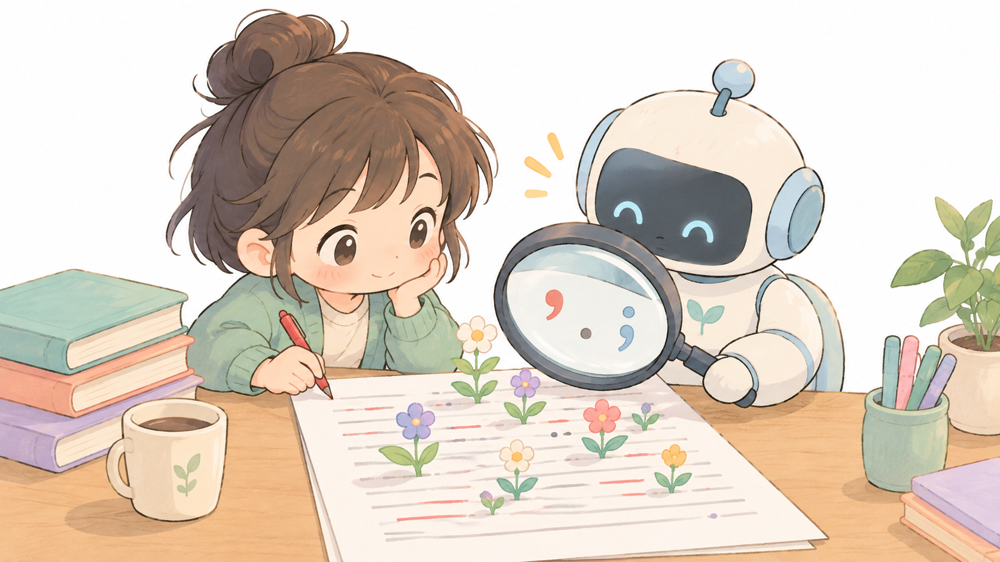
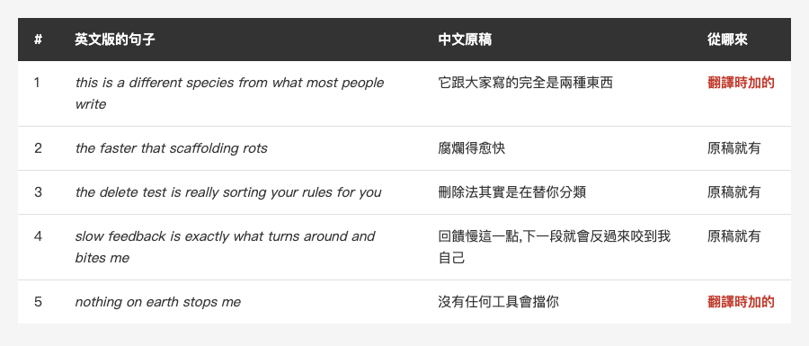
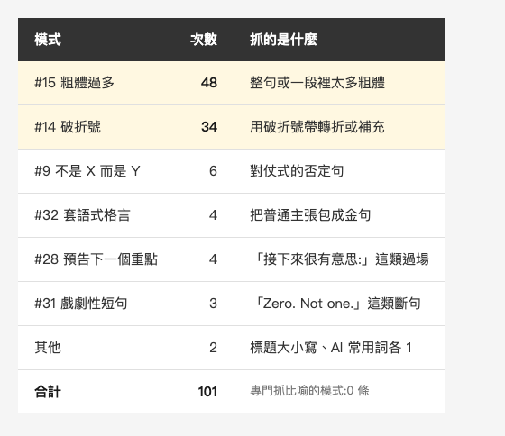
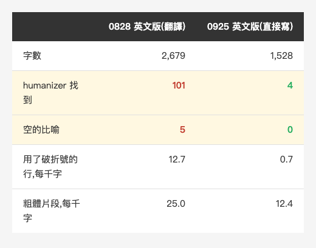

<!-- Tags: Claude Code, AI, Writing, Humanizer, Translation -->

*(在這裡插入封面圖:cover.png)*

<!--
Gemini prompt: A cute Ghibli-inspired soft pastel illustration. A chibi writer sits at a desk with a printed article, holding a red pen; beside the desk a friendly robot holds a large magnifying glass over the page, but it is examining the punctuation marks while a few small decorative flowers growing out of the text lines go unnoticed behind it. Soft pastel colors (mint, peach, lavender), white background, clean and simple, no text anywhere. 16:9 ratio.
-->

# humanizer 能幫你潤飾文章嗎?101 處建議,八成是粗體和破折號

> 我拿專門抓 AI 寫作痕跡的 humanizer,掃了一篇 AI 協助翻譯的英文文章,再請另一個 AI 當英文編輯獨立挑一次毛病,對照兩邊抓到的東西。

---

## 前言

[Apple 官方的 CLAUDE.md](https://medium.com/@n913239/apple-%E5%AE%98%E6%96%B9%E7%9A%84-claude-md-91-%E8%A1%8C-%E9%9B%B6%E5%8F%A5%E5%BB%A2%E8%A9%B1-%E9%82%A3%E4%BD%A0%E7%9A%84%E5%91%A2-a7d1cf8e555b) 那篇的英文版,在發文後大約 10 天被 Medium 推送:47K 次曝光、15.8K 次瀏覽,其中 67% 讀超過 30 秒,帶來淨增 48 位追蹤者。

這個系列的英文版,是從中文原稿經 AI 協助翻譯的。被推廣之後,留言區有人說它讀起來像 AI 寫的,其中一則具體指出:英文裡有很多「聽起來好聽、但沒有意思」的比喻。

「像 AI 寫的」是一個感覺,沒辦法直接改。最常被推薦的解法是 humanizer,一個專門抓 AI 寫作痕跡、也能幫你改寫的 Claude Code skill。這篇想知道的是:拿它來潤飾文章,它改到的是不是真正該改的地方?

---

## Part 1:先把「像 AI」變成可以數的東西

「像 AI」很難量,但**比喻聽起來好聽、但沒有意思**這件事可以數。

我請另一個 AI 當英文編輯,**不給它任何 AI 寫作檢查清單**,只用編輯的判斷,把 0828 英文版裡每一句用到比喻、擬人、格言的地方找出來,再分成三類:比喻底下有具體主張的、拿掉比喻就沒東西的、介於中間的。

結果:34 句用了比喻,**27 句有實質內容**,2 句介於中間,**5 句是空的**。

有實質內容的,像「一個工具是事後擋你,CLAUDE.md 是讓你一開始就不走那條路」:路是比喻,但底下是一個可以檢查的主張(事前預防 vs 事後攔截)。空的那 5 句,拿掉比喻就什麼都不剩:

*(在這裡插入圖片:table-empty.png)*

<!--
| # | 英文版的句子 | 中文原稿 | 從哪來 |
|---|---|---|---|
| 1 | this is a different species from what most people write | 它跟大家寫的完全是兩種東西 | 翻譯時加的 |
| 2 | the faster that scaffolding rots | 腐爛得愈快 | 原稿就有 |
| 3 | the delete test is really sorting your rules for you | 刪除法其實是在替你分類 | 原稿就有 |
| 4 | slow feedback is exactly what turns around and bites me | 回饋慢這一點,下一段就會反過來咬到我自己 | 原稿就有 |
| 5 | nothing on earth stops me | 沒有任何工具會擋你 | 翻譯時加的 |
-->

34 句裡只有 5 句是空的,比我預期的少。問題是真的,但集中在少數幾句,不是整篇。

---

## Part 2:5 句裡有 3 句是我自己寫的

我原本以為問題出在翻譯。對照中文原稿之後,**5 句裡只有 2 句是翻譯時長出來的。**

- 「它跟大家寫的完全是兩種東西」是平鋪直敘,翻成英文變成「a different species」。
- 「沒有任何工具會擋你」也是平的,翻成「nothing on earth stops me」。

另外 3 句,「腐爛」「替你分類」「反過來咬到我」,中文原稿就是這樣寫的。中文讀起來順,是因為這幾個詞在中文技術文章裡很常見;直譯成英文,就變成「聽起來好聽、但沒有意思」的句子。

所以只修翻譯不夠。**原稿裡的比喻,翻成英文時要先問一次:拿掉比喻之後,這句話還剩什麼事實?** 剩不下來的,英文版就直接寫事實。

---

## Part 3:humanizer 掃出來的東西

[humanizer](https://github.com/blader/humanizer) 是一個 Claude Code skill,GitHub 上有 51.7K 顆星,中文移植版也有 18K 顆。它把 Wikipedia 編輯社群整理的「AI 寫作特徵」寫成 35 個模式,從誇大意義、宣傳用語、模糊出處,到破折號、粗體、「不是 X 而是 Y」。

我讓它只診斷、不改寫,掃同一篇 0828 英文版。結果是 101 處:

*(在這裡插入圖片:table-patterns.png)*

<!--
| 模式 | 次數 | 抓的是什麼 |
|---|---:|---|
| #15 粗體過多 | 48 | 整句或一段裡太多粗體 |
| #14 破折號 | 34 | 用破折號帶轉折或補充 |
| #9 不是 X 而是 Y | 6 | 對仗式的否定句 |
| #32 套語式格言 | 4 | 把普通主張包成金句 |
| #28 預告下一個重點 | 4 | 「接下來很有意思:」這類過場 |
| #31 戲劇性短句 | 3 | 「Zero. Not one.」這類斷句 |
| 其他 | 2 | 標題大小寫、AI 常用詞各 1 |
-->

**八成是粗體和破折號。** 宣傳用語、模糊出處、填充語、AI 常用詞這些它最擅長抓的東西,幾乎是 0。它自己的總評是:這篇充滿具體數字、具名出處和個人細節,不像典型的 AI 文章。

然後我查了一件事:35 個模式裡,**沒有一條是專門抓比喻的。** 「比喻」只出現在兩張詞表的註解裡,最接近的是「套語式格言」和「假裝揭露更深的真相」。

---

## Part 4:對答案

把 Part 1 那 5 句空比喻,拿去跟 humanizer 的 101 處對照:

- **只有第 1 句被抓到**,而且是「弱」的等級,理由是套語式格言。
- 另外 4 句所在的那一行都有被標記,但標的是**同一行的破折號或粗體**,不是那個比喻。

換算一下:真正該改的 5 句,它抓到 1 句;它抓到的 101 處,跟空比喻有關的只有 1 處。

更有意思的是它的改寫範例。我請它挑三段最密集的段落示範改寫,結果:

- 「讓你一開始就不走那條路」被改成平鋪直敘。這句在 Part 1 是**有實質內容**的比喻。
- 「刪除法其實是在替你分類」被保留下來。這句在 Part 1 是**空的**。

它刪掉了有用的比喻,留下了空的。這不是它做錯,而是它本來就不是在判斷「這個比喻有沒有內容」;它在降低破折號和粗體的密度,比喻有沒有被改到,是順帶的。

這種落差不是 humanizer 獨有的。上週我拿另一個檢查 CLAUDE.md 品質的工具 [reporails](https://github.com/reporails/cli) 去跑 Apple 那份 91 行,它給 5.6 / 10,錯誤等級的扣分幾乎都是「沒寫 agent 角色」「沒列技術棧」「沒畫 mermaid 流程圖」這類通用清單項目。工具拿的是一份清單,而真正該改的地方,不一定在清單上。

---

## Part 5:但它抓的也不是錯的

說 humanizer 沒用,也不公平。

「像 AI」不只是比喻,還有**整篇的口氣**。這種感覺很難指出是哪一句,而 humanizer 抓到的那兩項,很可能就是它的來源:每 1,000 字有將近 13 行用了破折號、25 個粗體片段,再加上大約 10 處「A 是這樣,B 不是」的對仗句。單看每一句都沒問題,疊在一起就是一種節奏。

我的中文版 humanizer 把破折號和粗體列為「作者的既定風格」,不會被當成 AI 痕跡。這在中文沒問題,但套在英文就藏住了一個真的訊號:**英文的 AI 寫作清單把破折號列為特徵之一**,Wikipedia 那份和 humanizer 都是;我的中文版卻把它放進白名單。

0925 那篇英文版,我沒有翻譯中文,而是直接用平實的英文寫。拿同一套方法量:

*(在這裡插入圖片:table-compare.png)*

<!--
| | 0828 英文版(翻譯) | 0925 英文版(直接寫) |
|---|---:|---:|
| 字數 | 2,679 | 1,528 |
| humanizer 找到 | 101 | 4 |
| 空的比喻 | 5 | 0 |
| 用了破折號的行,每千字 | 12.7 | 0.7 |
| 粗體片段,每千字 | 25.0 | 12.4 |
-->

0925 的 4 處全是格式慣例(標題大小寫、粗體標籤),沒有比喻。

這張表只能說明「寫法變了,工具量到的東西跟著變了」。0925 的英文版還沒有足夠的讀者回饋,所以我還不能說它解決了「像 AI 寫的」這個感覺。

---

## 總結

回到標題的問題:humanizer 能幫你潤飾文章嗎?

**具體的那一種(空的比喻),它幾乎抓不到**:5 句中 1 句,而且是弱判定。這不是它做壞了,是它沒有這條規則。

**說不清楚的那一種(整篇的口氣),它抓到的可能正是原因**:破折號、粗體和對仗句的密度。

所以我現在的做法分成兩步:

1. **比喻交給人判斷。** 每一句比喻問一次:拿掉之後還剩什麼事實?剩不下來就改寫。這一步沒有工具可以代勞。
2. **密度交給 humanizer 量。** 只診斷、不讓它改檔,看的是破折號和粗體有沒有堆起來,而不是逐條照改。

還有一條是這次才確定的:**英文版不從中文翻,直接用英文寫。** 5 句空比喻裡有 2 句是翻譯時才長出來的;另外 3 句,中文讀起來順,英文讀起來就空了。

---

## 參考資料

- [blader/humanizer](https://github.com/blader/humanizer) — 本篇用的 v2.11.2,35 個模式
- [Wikipedia: Signs of AI writing](https://en.wikipedia.org/wiki/Wikipedia:Signs_of_AI_writing) — humanizer 模式的原始出處,由 WikiProject AI Cleanup 維護
- [op7418/Humanizer-zh](https://github.com/op7418/Humanizer-zh) — 中文移植版
- [reporails/cli](https://github.com/reporails/cli) — Part 4 提到的 CLAUDE.md 檢查工具,v0.5.12
- 系列前篇:[Apple 官方的 CLAUDE.md:91 行,零句廢話——那你的呢?](https://medium.com/@n913239/apple-%E5%AE%98%E6%96%B9%E7%9A%84-claude-md-91-%E8%A1%8C-%E9%9B%B6%E5%8F%A5%E5%BB%A2%E8%A9%B1-%E9%82%A3%E4%BD%A0%E7%9A%84%E5%91%A2-a7d1cf8e555b) — 本篇拿來檢查的那一篇
- 系列前篇:[九年、三屆鐵人賽:從教人開雲端主機,到教人別全信 AI](https://medium.com/@n913239/%E4%B9%9D%E5%B9%B4-%E4%B8%89%E5%B1%86%E9%90%B5%E4%BA%BA%E8%B3%BD-%E5%BE%9E%E6%95%99%E4%BA%BA%E9%96%8B%E9%9B%B2%E7%AB%AF%E4%B8%BB%E6%A9%9F-%E5%88%B0%E6%95%99%E4%BA%BA%E5%88%A5%E5%85%A8%E4%BF%A1-ai-4e25dfa99132) — Part 5 對照組,英文版直接用英文寫的第一篇
