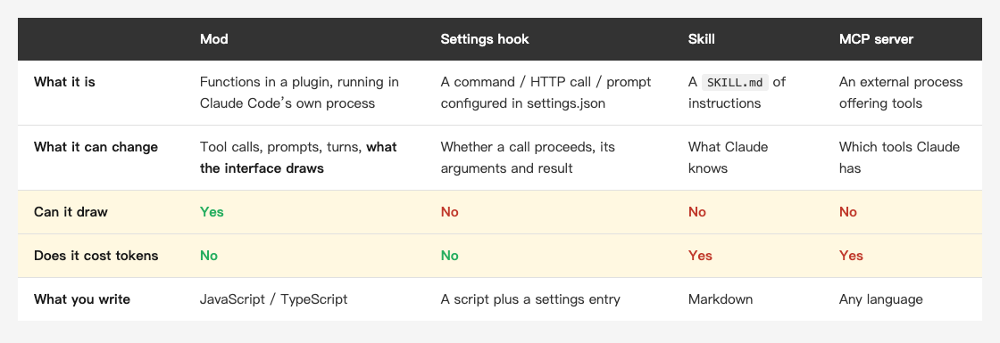
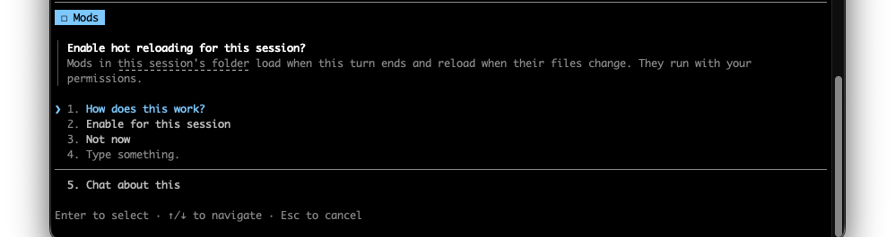
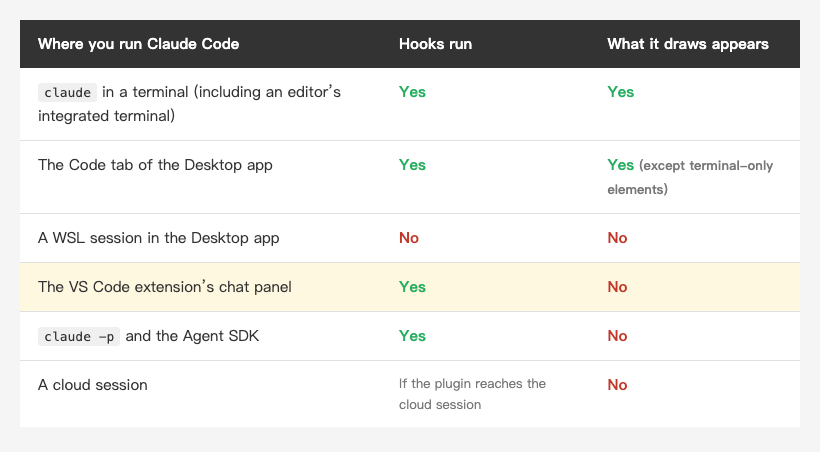
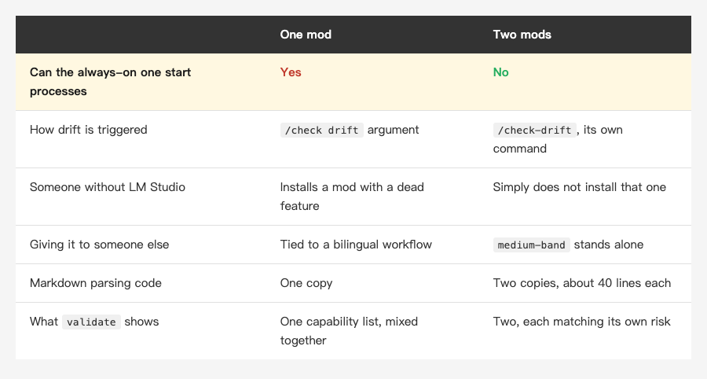
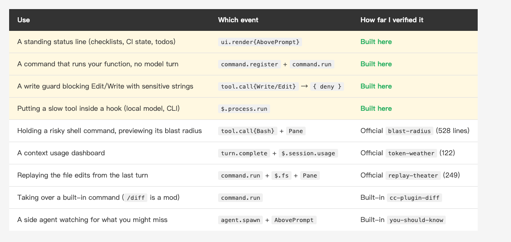

<!-- Tags: Claude Code, AI, Developer Tools, Local LLM, Productivity -->

# A month ago I built an MCP server. This week I rebuilt it with Claude Mods

*(Insert cover image here: cover.png)*

<!--
Gemini prompt: A cozy Ghibli-style pastel illustration, soft mint/peach/lavender
palette on white background, 16:9. Two small friendly robots: one stands outside
a glass terminal window holding a clipboard, waiting to be called in; the other
sits inside the window with the same clipboard, already working. Warm, gentle,
no text, no letters.
-->

[A month ago I wrote about](https://medium.com/@n913239/%E8%87%AA%E5%B7%B1%E5%81%9A%E4%B8%80%E5%80%8B-mcp-server-237-%E8%A1%8C-%E7%AC%AC%E4%B8%80%E6%AC%A1%E8%B7%91%E5%B0%B1%E6%8A%93%E5%88%B0%E6%88%91%E4%B8%89%E5%80%8B%E6%9C%88%E5%89%8D%E6%B4%A9%E6%BC%8F%E7%9A%84%E6%9D%B1%E8%A5%BF)
turning my pre-publish checklist into an MCP server. That server is 307 lines now and runs nine checks.

This week I rebuilt the same thing with **Claude Mods**. 277 lines. Thirty lines shorter, which is not much of a win.

What it gained is two things an MCP server cannot do at all. That gap is what this post is about.

---

## First, what this new thing is

On 2026-10-02, Claude Code 2.1.287 added **Claude Mods**: a plugin can now ship a JavaScript
or TypeScript file whose functions run **inside Claude Code's own process**. A plugin that
has one is called a mod.

I have written about several ways to extend Claude Code in this series —
[CLAUDE.md](https://medium.com/@n913239/claude-md-%E5%AE%8C%E5%85%A8%E6%94%BB%E7%95%A5-%E8%AE%93-claude-code-%E7%9C%9F%E6%AD%A3%E7%90%86%E8%A7%A3%E4%BD%A0%E7%9A%84%E5%B0%88%E6%A1%88-3a9478865a11),
skills, settings hooks, MCP servers. They share something I had not noticed until now:
**all of them stand outside**.

A skill hands Claude a note. An MCP server waits in its own process to be called. A settings
hook runs a script after something happens. None of them can say "not this time," and none of
them can put anything on screen.

*(Insert image here: table-compare-en.png)*

<!--
| | Mod | Settings hook | Skill | MCP server |
|---|---|---|---|---|
| What it is | Functions in a plugin, running in Claude Code's own process | A command / HTTP call / prompt configured in settings.json | A `SKILL.md` of instructions | An external process offering tools |
| What it can change | Tool calls, prompts, turns, **what the interface draws** | Whether a call proceeds, its arguments and result | What Claude knows | Which tools Claude has |
| Can it draw | **Yes** | No | No | No |
| Does it cost tokens | No | No | Yes | Yes |
| What you write | JavaScript / TypeScript | A script plus a settings entry | Markdown | Any language |
-->

---

## Part 1: Three files

The smallest mod is three files:

```text
medium-band/
├── .claude-plugin/plugin.json     # the plugin manifest
└── hooks/
    ├── hooks.json                 # { "modules": ["./register.tsx"] }
    └── register.tsx               # the actual code
```

`register.tsx` exports `register(on)` and registers hooks with `on(event, matcher?, hook)`.
Every hook is `($, e, next)`:

- `$` is the engine interface. Anything outside your own code goes through it (`$.fs.read`, `$.ui.resolve`, `$.process.run`)
- `e` is the event, as frozen plain data
- `next(e)` continues to the other mods, then to the engine itself

So a hook has three choices: **watch it go by** (`return next(e)`), **rewrite it**
(`next({ ...e, ... })`), or **answer for itself** (never call `next`).

### Turning on hot reload is something only you can do

The moment I wrote the first file into the session's mods folder, a question appeared:

*(Insert image here: hot-reload-prompt.png)*


Note its second line: **They run with your permissions.** No permission mode, settings rule or
hook can answer this question. Only the person at the keyboard can.

I picked `Not now` on purpose, to see what happens. This is what the engine reported back to
the model:

```
The person declined mod hot-reloading: what this run wrote under
/Users/.../dev-mods/<session-id> is written but NOT loaded.
Do not say the change is running. It loads the next time this session
starts (/reload-plugins reloads only a mod that loaded at the start);
the person can ask again.
```

`Do not say the change is running.` It does not just decline to load the code. It also stops the
model from claiming the change took effect.

Claude followed it in that run. It told me the mod was written but not loaded, that I had just
declined hot reloading, that nothing would appear above the prompt yet, and then listed the
path and the two ways to load it later.

The model writes the files and the person flips the switch, and both sides of that line are
guarded: nothing loads until a person says so, and if the model were inclined to report success
anyway, the engine got there first.

### Not everywhere can draw

Hooks run almost everywhere. Drawing is narrower — only the terminal and the desktop app:

*(Insert image here: table-where-en.png)*

<!--
| Where you run Claude Code | Hooks run | What it draws appears |
|---|---|---|
| `claude` in a terminal (including an editor's integrated terminal) | Yes | Yes |
| The Code tab of the Desktop app | Yes | Yes, except terminal-only elements |
| A WSL session in the Desktop app | No | No |
| The VS Code extension's chat panel | Yes | No |
| `claude -p` and the Agent SDK | Yes | No |
| A cloud session | If the plugin reaches the cloud session | No |
-->

---

## Part 2: The first thing an MCP server cannot do — it is always there

The checks in my MCP server were fine. The problem was that **it only runs when something calls it**.

In practice that meant: write for half an hour, remember to check, ask Claude to run
`check_article`, wait a turn and a few thousand tokens for a table, fix things, write for
another half hour, forget again.

The mod turns that same table into one line above the prompt:

```
2026-10-05_claude-code-mods ✗ 1 項未過 — index-en.md                    [-]
```

I wrote the line. The `[-]` collapse control on the right is the engine's. It sits there all
the time and recomputes every time I write a file. I never have to remember.

The hook that draws it:

```tsx
on('ui.render', { component: 'AbovePrompt' }, async ($, e, next) => {
  const made = await read($, report)
  if (made === null || !Array.isArray(made.rows)) return next(e)

  const { Box, Text } = $.ui.resolve(e)
  const good = made.failed === 0

  return (
    <Box>
      <Text dimColor>{made.slug} </Text>
      <Text color={good ? 'green' : 'yellow'}>
        {good ? `✓ ${made.rows.length} checks passed` : `✗ ${made.failed} failed`}
      </Text>
    </Box>
  )
})
```

The elements are not imported. `$.ui.resolve(e)` hands them over, because the terminal, the
desktop app, VS Code and mobile each have a different element table, and `resolve` returns the
one that **this** surface can actually draw.

---

## Part 3: The second thing — nothing has to wake the model first

A mod can register its own command, and that command **runs your function directly**: no model
turn, and it works while Claude is busy.

```
> /check-drift

medium-band: 2026-10-05_claude-code-mods — 14 項,0 項未過

✓ tags[zh]               5 個(上限 5)
✓ fences[zh]             26 個 (偶數)
✓ image-markers[zh]      圖 3 張 vs 提示行 3 行
✓ closing[zh]            結尾兩節 ["總結","參考資料"],應為 ["總結","參考資料"]
✓ placeholders[zh]       無殘留
✓ fullwidth[zh]          無全形標點
✓ tags[en]               5 個(上限 5)
✓ fences[en]             26 個 (偶數)
✓ image-markers[en]      圖 3 張 vs 提示行 3 行
✓ closing[en]            結尾兩節 ["Summary","References"],應為 ["Summary","References"]
✓ placeholders[en]       無殘留
✓ parity-h2              中 8 / 英 8
✓ parity-h3              中 7 / 英 7
✓ parity-images          中 3 / 英 3

地端逐節語意比對:
  先講這個新東西是什麼:OK
  Part 1:三個檔案:OK
  Part 2:MCP server 做不到的第一件事 —— 它一直在:OK
  Part 3:做不到的第二件事 —— 不花 token:OK
  Part 4:我寫壞的兩個地方,和引擎怎麼處理:OK
  Part 5:它憑什麼敢讓你裝別人的 mod:OK
  總結:OK
```

That is the real output, pasted as it came, from this post checking itself. It is in Chinese
because the mod is mine and I write in Chinese first; `tags`, `fences`, `parity-h2` and the rest
are the check names, and `0 項未過` means nothing failed. The bottom block is the local model's
verdict on each section of the two language versions.

One thing I had wrong in an earlier draft: **that output still goes into the context**. The
`text` a `command.run` hook returns is, in the declaration file's words, "the command's output as
a transcript line", and the model reads it. A mod's command is not free.

What it does save is two other things:

- **Nothing has to wake the model first.** Through MCP the sequence is: I ask, Claude works out
  which tool to call, sends the tool call, reads the result, and tells me about it. Deciding to
  call it costs a round of inference on its own. With the mod I press the key and the function runs.
- **No tool definitions sitting in context.** An MCP server's tool schemas are in the context
  **every turn**, whether that turn needs them or not. A command has no such standing cost.

The band in the previous section is the one that really costs nothing. What `ui.render` draws is
never a transcript row, so the model never sees it at all.

### I set out to calculate the monthly token saving and found something else

I publish weekly, so my assumption was that a month of this adds up to real savings. I went to
measure it.

For the standing cost of a tool definition, `/context` gives a per-tool number:

```
MCP tools · /mcp (loaded on-demand)

Loaded
└ mcp__medium-check__check_article: 174 tokens
```

**174 tokens.** And the line above it in the same report:

```
⛁ MCP tools: 174 tokens (0.0%)
⛁ Messages: 414.8k tokens (41.5%)
```

Tool definitions are **0.0%** of the context. `list_articles` was not even loaded: tools are
pulled in on demand. The per-turn cost I had assumed was there is 174 tokens.

What about the results? For this article's own check run:

- The MCP server returns JSON: 2,083 characters for 20 checks, **104 characters per check**
- The mod returns formatted text: 737 characters for 14 checks, **53 characters per check**

The `{"name": ..., "ok": true, "detail": ...}` wrapper doubles the cost of every row. Real, but
about a thousand characters per run.

**So the answer to "how much does a month of this save" is: not much.** Thirty check runs in a
month come to something like twenty thousand tokens of difference, against a single session here
that used 454k. That is noise.

I left this section in because I had planned to use it as the selling point. Measuring it showed
the selling point is elsewhere:

- "It costs no tokens" is wrong. Command output goes into the transcript like anything else
- "It saves a lot of tokens" is also wrong. Tool definitions are 0.0% of the context
- What actually differs is that **it is always there** (the band never enters the transcript) and
  that **nothing has to wake the model** (what you save is a round of inference, not a few tokens)

Saving tokens is not the reason. **Not having to ask** is.

Registering it takes two blocks:

```ts
on('session.start', async ($, e, next) => {
  await $.command.register({ name: 'check', description: 'run the pre-publish checks' })
  return next(e)
})

on('command.run', { command: 'check' }, async ($, e) => {
  const made = await runChecks($)
  return { text: format(made) }
})
```

### A local model for the one check a regex cannot do

All of those are countable: how many tags, are the backticks even, do the image counts match.
`parity-h2` already confirms both versions have the same number of sections. But equal counts
say nothing about whether the two versions make the same points. I could add a whole argument
to the Chinese version and every check above would still be green.

So the second layer splits both files into H2 sections and sends each **pair of section bodies**
to a model running on my own machine:

```ts
async function askDrift($: EngineInterface, zh: string[], en: string[]) {
  const a = sections(zh)
  const b = sections(en)
  if (a.length !== b.length) {
    return [`section counts differ: zh ${a.length} / en ${b.length}`]
  }

  const out: string[] = []
  for (let i = 0; i < a.length; i += 1) {
    const body = ['中文:', a[i].body.slice(0, 2500), '', '英文:', b[i].body.slice(0, 2500)].join('\n')
    const ran = await $.process.run(['lm', '-f', DRIFT_ASK], { stdin: body, timeoutMs: 180000 })
    out.push(`${a[i].title}: ${ran.exitCode === 0 ? ran.stdout.trim() : 'no answer'}`)
  }
  return out
}
```

`sections()` drops code blocks on the way (the code is identical in both versions, so sending it
wastes context) and skips the references section, where the links legitimately differ.

Local is not about saving money here. It is that **the draft should not leave this machine**.
Seven sections of full draft text go into that call, and I would not send that to a cloud model.

There is a cost to state. This change turned `/check drift` from instant into **one to three
minutes** (seven sections, one call each). Putting semantic judgement into a checklist means
giving up on it being instant. That is why it is a separate `/check-drift`: a plain `/check`
still answers immediately, and I run the slow one once, before publishing.

### How a slow model fits inside a hook

The local model takes 5 to 20 seconds per call. A hook's time budget is 10 seconds:

```ts
export type HookBudget = {
    readonly ms: 10_000;
    ...
}
```

That should time out. The next sentence in the declaration file is the one that matters:

> Each bounds the hook's **OWN** time: the clock stops while a `next(e)` call or
> any `$` call of the hook's is in flight.

**The clock stops while you wait on `$`.** So `$.process.run` can take a minute and the hook's
budget does not move. This is not a loophole I found; it is the example the declaration file
gives.

---

## Part 4: The two things I got wrong, and what the engine did about them

### What I stored was a Promise, not data

After the first load, no band appeared. One line showed up in the transcript:

```
medium-band: ui.render hook skipped: threw TypeError:
undefined is not an object (evaluating 'made.rows.filter')
```

I had handed an async function straight to `update`:

```ts
void update($, report, async () => await runChecks($))   // wrong
```

What went into `$.state` was a Promise, so `made.rows` was `undefined` at the next draw.

I made a mistake. What matters is that the session carried on. The engine skipped that hook,
drew its own, and left one line naming the mod, the event and the reason. I kept working, minus
one line of display.

### Skipping in silence

The second one nearly got past me. `/check drift` printed exactly what `/check` printed,
because the English version did not exist yet and my code said "compare only if both are
there" — and said nothing otherwise.

Asking for a drift check and being told nothing reads like a clean result. Now it always
reports, including why it did not run:

```
local comparison: skipped, no English version yet
```

Soon after fixing that, the same mistake came back from another direction. I mistyped the
command as `/check deift`. It ran all the checks and said nothing at all about the argument,
because my condition was `args.includes('drift')`: a typo makes it false, and then nothing
is said.

Both are the same fault: **the user gave input and the program quietly pretended there was
none**. Unrecognised arguments now get named:

```
unrecognised argument: deift (only 'drift' is understood)
```

This matters less in a script running off to the side, because you read its output anyway.
A band and a command are **interface**, and an interface that stays quiet is saying
"nothing to see here".

---

## Part 5: Why installing someone else's mod is not reckless

A mod runs inside Claude Code's process, as you, and **it is not sandboxed**. The official docs
list what it can reach: read and write any file your account can, read environment variables and
settings files including an API key, see every prompt and every tool call, rewrite them,
**approve a tool call on your behalf**, and spend your quota on model calls.

So the question is whether you can tell what it does before you install it.

The answer is one command, and it **does not run the mod**:

```
$ claude plugin validate ./medium-band

  ❯ hooks: session.start, command.run{command=check},
           tool.call, ui.render{component=AbovePrompt}
  ❯ calls: $.command.register, $.fs.list (via currentArticle),
           $.fs.read (via readLines),
           $.session.cwd (via currentArticle, storyRoot),
           $.state.get, $.state.set, $.ui.resolve
✔ Validation passed
```

Which events it hooks, which capabilities it calls — **and which helper each call goes through**.

### Why that list can be trusted

Because the engine **enforces a code shape** so it can analyse statically.

My first version put the helpers inside `register` as closures. `validate` refused it:

```
✘ $ is passed to "guard", which is not a function declared at the top of
  this file (a function declaration, or a const bound to one)
```

A hook can only act through `$`, and `$` can only flow into functions declared at the top of
the file. Put those two limits together and "what will this mod call" becomes something you can
enumerate at compile time.

You pay for that with freedom in how you write. I think it is worth it. Compared with reading a
Markdown file and guessing at intent, it is a different kind of guarantee.

### Then the list caught me

That output is from the second version. This post originally had **one** mod, and its `calls:`
line read:

```
  ❯ calls: ..., $.process.run (via askDrift), ...
```

A mod hooked on `tool.call`, **running on every file write**, that **can start processes**.
That is the shape this section warns readers about, and I had written it myself.

So I split it in two:

- `medium-band` (257 lines): always on, hooked on `tool.call` and `ui.render`. It can read files, read state and draw, and nothing else
- `medium-drift` (126 lines): one `command.run` hook. It holds `$.process.run`, but only wakes up when you type `/check-drift`

**The one that is always on can no longer start processes, and the one that can is not always on.**

*(Insert image here: table-split-en.png)*

<!--
| | One mod | Two mods |
|---|---|---|
| **Can the always-on one start processes** | **Yes** | **No** |
| How drift is triggered | `/check drift` argument | `/check-drift`, its own command |
| Someone without LM Studio | Installs a mod with a dead feature | Simply does not install that one |
| Giving it to someone else | Tied to a bilingual workflow | `medium-band` stands alone |
| Markdown parsing code | One copy | Two copies, about 40 lines each |
| What `validate` shows | One capability list, mixed together | Two, each matching its own risk |
-->

The rows after the first are convenience. The first one is not. Something that **wakes on every
file write** holding the power to start processes, and something that **wakes only when you press
it** holding the same power, are not the same thing.

The cost is about forty lines of markdown parsing duplicated across both. I did not use
`dependencies` to share it: that mechanism is for sharing capabilities on `$`, not a handful of
string functions, and coupling the two plugins to avoid the duplication would have been the
worse trade.

Two side benefits came with the split. `medium-drift` needs LM Studio running locally, so
someone without a local model simply does not install it, instead of installing a mod with a
dead feature. And `medium-band` is not tied to any language workflow, so it is usable by
someone else as it stands.

---

## What else it is good for

This post uses four events. The declaration file has about a hundred. The table below lists only
what I **ran myself**, or what ships with **public source that I read and ran
`claude plugin validate` against**. Nothing I have not run.

*(Insert image here: table-uses-en.png)*

<!--
| Use | Which event | How far I verified it |
|---|---|---|
| A standing status line (checklists, CI state, todos) | `ui.render{AbovePrompt}` | Built in this post |
| A command that runs your function, with no model turn | `command.register` + `command.run` | Built in this post |
| A write guard that blocks Edit/Write containing sensitive strings | `tool.call{Write/Edit}` → `{ deny }` | Built in this post |
| Putting a slow tool inside a hook (local model, external CLI) | `$.process.run` | Built in this post |
| Holding a risky shell command and previewing its blast radius, with buttons | `tool.call{Bash}` + `Pane` | Official `blast-radius` (528 lines) |
| A context usage dashboard | `turn.complete` + `$.session.usage` | Official `token-weather` (122 lines) |
| Replaying the file edits from the last turn | `command.run` + `$.fs` + `Pane` | Official `replay-theater` (249 lines) |
| Taking over a built-in command (`/diff` is itself a mod) | `command.run` | Built-in `cc-plugin-diff` |
| A side agent watching for what you and Claude might miss | `agent.spawn` + `AbovePrompt` | Built-in `you-should-know` |
-->

The last five all have source you can read: the first three in
[`claude-code-playground`](https://github.com/anthropics/claude-code-playground/tree/main/claude-code/mods),
the last two in [`claude-code/mods`](https://github.com/anthropics/claude-code/tree/main/mods),
because they are Claude Code's own features. **Anthropic wrote `/diff` and the `AGENTS.md` loader
as mods**, which says more about how serious this API is than any documentation could.

A few other entries in the declaration file look interesting, and I did not go through them, so
they are not in the table above: `$.tool.register` (give Claude a new tool without writing an MCP
server), `prompt.compose` (rewrite a section of the system prompt), `session.append` (every row
the conversation keeps passes through it), and `$.model.fork` (ask a cheap question over the same
transcript prefix).

---

## Summary

Same requirement, built twice, a month apart. They are not the same category of thing:

- An MCP server gives Claude tools. It waits to be called and costs tokens, but it works across apps and you can write it in any language
- A mod changes Claude Code itself. Nothing has to call it, it costs no tokens and it can draw, but it only exists inside this one product

The checking logic went from 307 lines to 277. Almost nothing changed. What changed is where it stands.

A few numbers and caveats:

- Claude Mods landed in **2.1.287** (2026-10-02) and is on by default
- A hook's 10-second budget **stops while it waits on `$`**, which is how a slow local model fits inside one
- `claude plugin validate` lists a mod's full capability set without running it
- The API is explicitly early access and moves between releases. Everything here ran on **2.1.289**; trust the declaration file on your own machine

All of the mod's code, its six tests and the MCP server version are in the repo link below, side by side.

---

## References

- [Mods overview](https://code.claude.com/docs/en/plugins/mods/overview) — the official docs; subpages cover create / interface / events / api / test / troubleshoot / admin / reference
- [Official sample mods](https://github.com/anthropics/claude-code-playground/tree/main/claude-code/mods) — `token-weather` (122 lines), `replay-theater` (249), `blast-radius` (528)
- [Source of the built-in mods](https://github.com/anthropics/claude-code/tree/main/mods) — `/diff` is itself a mod
- The authoritative declaration file is local: load the `plugin-authoring` skill in a session and the engine writes `types/claude-code.d.ts` for your build (20,354 lines on 2.1.289)
- [Can humanizer polish your writing?](https://medium.com/@n913239/can-humanizer-polish-your-writing-334cb6726eb7) — the previous post in this series
