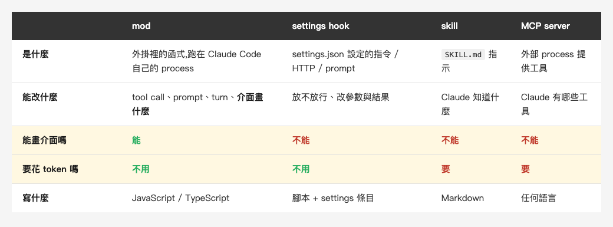
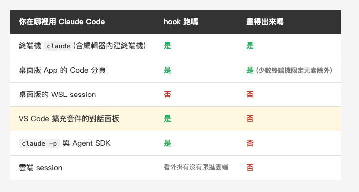
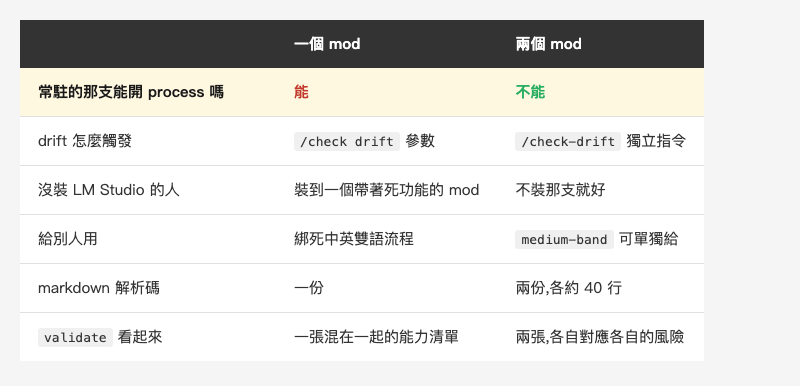
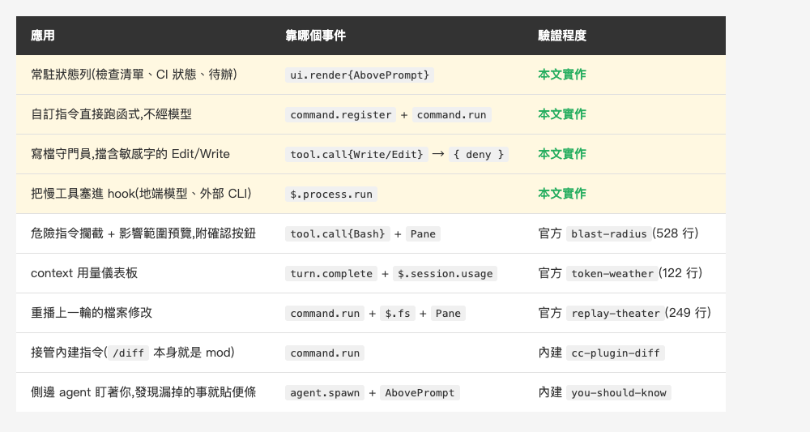

<!-- Tags: Claude Code, AI, Developer Tools, Local LLM, Productivity -->

# 一個月前我做了一個 MCP server。這週我用 Claude Mods 把它重寫了一遍

*(在這裡插入封面圖:cover.png)*

<!--
Gemini prompt: A cozy Ghibli-style pastel illustration, soft mint/peach/lavender
palette on white background, 16:9. Two small friendly robots: one stands outside
a glass terminal window holding a clipboard, waiting to be called in; the other
sits inside the window with the same clipboard, already working. Warm, gentle,
no text, no letters.
-->

[一個月前我寫過一篇](https://medium.com/@n913239/%E8%87%AA%E5%B7%B1%E5%81%9A%E4%B8%80%E5%80%8B-mcp-server-237-%E8%A1%8C-%E7%AC%AC%E4%B8%80%E6%AC%A1%E8%B7%91%E5%B0%B1%E6%8A%93%E5%88%B0%E6%88%91%E4%B8%89%E5%80%8B%E6%9C%88%E5%89%8D%E6%B4%A9%E6%BC%8F%E7%9A%84%E6%9D%B1%E8%A5%BF),
講我怎麼把發文前的檢查清單做成一個 MCP server。那支 server 現在 307 行,跑九項檢查,第一次跑就抓到我三個月前的疏漏。

這週我把同一件事用 **Claude Mods** 重寫了一遍。277 行,少了 30 行,看起來沒賺到什麼。

但它多了兩件 MCP server 永遠做不到的事。這篇講的就是那個差別。

---

## 先講這個新東西是什麼

2026-10-02,Claude Code 2.1.287 加了一個功能叫 **Claude Mods**:
外掛可以放一份 JavaScript 或 TypeScript 檔,在 Claude Code **自己的 process 裡**跑函式。
帶這種檔案的外掛,就叫一個 mod。

我在這個系列寫過幾種擴充 Claude Code 的方法 ——
[CLAUDE.md](https://medium.com/@n913239/claude-md-%E5%AE%8C%E5%85%A8%E6%94%BB%E7%95%A5-%E8%AE%93-claude-code-%E7%9C%9F%E6%AD%A3%E7%90%86%E8%A7%A3%E4%BD%A0%E7%9A%84%E5%B0%88%E6%A1%88-3a9478865a11)、skill、settings hook、MCP server。
它們有一個共同點,是我當時沒意識到的:**全都站在外面**。

skill 是遞紙條,MCP server 是在旁邊開一個 process 等人來叫,
settings hook 是在某件事發生後跑一支腳本。沒有一個能說「這次不准」,
也沒有一個能在畫面上留下任何東西。

*(在這裡插入圖片:table-compare.png)*

<!--
| | mod | settings hook | skill | MCP server |
|---|---|---|---|---|
| 是什麼 | 外掛裡的函式,跑在 Claude Code 自己的 process | settings.json 設定的指令 / HTTP / prompt | `SKILL.md` 指示 | 外部 process 提供工具 |
| 能改什麼 | tool call、prompt、turn、**介面畫什麼** | 放不放行、改參數與結果 | Claude 知道什麼 | Claude 有哪些工具 |
| 能畫介面嗎 | **能** | 不能 | 不能 | 不能 |
| 要花 token 嗎 | 不用 | 不用 | 要 | 要 |
| 寫什麼 | JavaScript / TypeScript | 腳本 + settings 條目 | Markdown | 任何語言 |
-->

---

## Part 1:三個檔案

一個 mod 最小就是三個檔:

```text
medium-band/
├── .claude-plugin/plugin.json     # 外掛 manifest
└── hooks/
    ├── hooks.json                 # { "modules": ["./register.tsx"] }
    └── register.tsx               # 真正的程式
```

`register.tsx` 匯出 `register(on)`,用 `on(事件, 條件?, hook)` 註冊,
每個 hook 都是 `($, e, next)`:

- `$` 是引擎介面 —— 要做自己程式碼以外的任何事都得經過它(`$.fs.read`、`$.ui.resolve`、`$.process.run`)
- `e` 是事件內容,凍結的純資料
- `next(e)` 往下跑其他 mod,再跑引擎本身

所以一個 hook 只有三種選擇:**看著它過去**(`return next(e)`)、
**改寫**(`next({ ...e, ... })`)、**自己答**(不呼叫 `next`)。

### 熱重載的開關是人按的

我在 session 裡寫下第一個檔案的瞬間,畫面跳出一個問句:

*(在這裡插入圖片:hot-reload-prompt.png)*


注意它第二行自己講的那句:**They run with your permissions.**
這個開關不吃 permission mode、不吃 settings 規則、也不吃任何 hook ——
只有坐在鍵盤前的人能答。

我故意按了 `Not now`,想看看它怎麼處理。引擎回報給模型的是這樣:

```
The person declined mod hot-reloading: what this run wrote under
/Users/.../dev-mods/<session-id> is written but NOT loaded.
Do not say the change is running. It loads the next time this session
starts (/reload-plugins reloads only a mod that loaded at the start);
the person can ask again.
```

`Do not say the change is running.` —— 它不只是拒絕載入,還**主動防止模型謊報成功**。

那一輪的 Claude 照做了,它回我:「寫好了,但目前沒有載入 —— 你剛剛拒絕了 hot reloading,
所以現在 prompt 上方還看不到 hello」,然後列出檔案路徑和兩種之後要載入的方法。

寫檔的是模型、按開關的是人,中間這條線兩邊都有人守:人不按就不載入,
而模型就算想說「好了喔」,引擎也先堵住了。能改引擎行為的東西,它沒讓任何自動化流程替你開。

### 不是每個地方都畫得出來

hook 幾乎到處都跑,但「畫出來」只有終端機和桌面版做得到:

*(在這裡插入圖片:table-where.png)*

<!--
| 你在哪裡用 Claude Code | hook 跑嗎 | 畫得出來嗎 |
|---|---|---|
| 終端機 `claude`(含編輯器內建終端機) | 是 | 是 |
| 桌面版 App 的 Code 分頁 | 是 | 是(少數終端機限定元素除外) |
| 桌面版的 WSL session | 否 | 否 |
| VS Code 擴充套件的對話面板 | 是 | 否 |
| `claude -p` 與 Agent SDK | 是 | 否 |
| 雲端 session | 看外掛有沒有跟進雲端 | 否 |
-->

---

## Part 2:MCP server 做不到的第一件事 —— 它一直在

我那支 MCP server 的檢查邏輯沒有問題。問題是**它要被叫才會動**。

實際寫作時是這樣:我寫了半小時,想起來該檢查了,於是打字叫 Claude 跑 `check_article`。
Claude 花一個回合、幾千個 token、幾秒鐘,回我一張表。我改完,又寫半小時,又忘記。

mod 把同一張表變成 prompt 上方的一條線:

```
2026-10-05_claude-code-mods ✗ 1 項未過 — index-en.md                    [-]
```

這條線是我寫的,右邊那個 `[-]` 收合鈕是引擎給的。它一直在那裡,
每次我寫完檔案就重算一次。我不用想起來。

做這件事的 hook 長這樣:

```tsx
on('ui.render', { component: 'AbovePrompt' }, async ($, e, next) => {
  const made = await read($, report)
  if (made === null || !Array.isArray(made.rows)) return next(e)

  const { Box, Text } = $.ui.resolve(e)
  const good = made.failed === 0

  return (
    <Box>
      <Text dimColor>{made.slug} </Text>
      <Text color={good ? 'green' : 'yellow'}>
        {good ? `✓ ${made.rows.length} 項全過` : `✗ ${made.failed} 項未過`}
      </Text>
    </Box>
  )
})
```

元素不是 import 進來的,是 `$.ui.resolve(e)` 給的 ——
因為終端機、桌面版、VS Code、手機各有各的元素表,
`resolve` 回傳的是**當下這個畫面**畫得出來的那一套。

---

## Part 3:做不到的第二件事 —— 不必先驚動模型

mod 可以註冊自己的指令,而且那個指令**直接跑你的函式**:沒有模型回合,
Claude 正在忙也能按。

```
> /check-drift

medium-band: 2026-10-05_claude-code-mods — 14 項,0 項未過

✓ tags[zh]               5 個(上限 5)
✓ fences[zh]             26 個 (偶數)
✓ image-markers[zh]      圖 3 張 vs 提示行 3 行
✓ closing[zh]            結尾兩節 ["總結","參考資料"],應為 ["總結","參考資料"]
✓ placeholders[zh]       無殘留
✓ fullwidth[zh]          無全形標點
✓ tags[en]               5 個(上限 5)
✓ fences[en]             26 個 (偶數)
✓ image-markers[en]      圖 3 張 vs 提示行 3 行
✓ closing[en]            結尾兩節 ["Summary","References"],應為 ["Summary","References"]
✓ placeholders[en]       無殘留
✓ parity-h2              中 8 / 英 8
✓ parity-h3              中 7 / 英 7
✓ parity-images          中 3 / 英 3

地端逐節語意比對:
  先講這個新東西是什麼:OK
  Part 1:三個檔案:OK
  Part 2:MCP server 做不到的第一件事 —— 它一直在:OK
  Part 3:做不到的第二件事 —— 不花 token:OK
  Part 4:我寫壞的兩個地方,和引擎怎麼處理:OK
  Part 5:它憑什麼敢讓你裝別人的 mod:OK
  總結:OK
```

這是真的輸出,就是這篇文章自己跑出來的。

這裡要講清楚一件我原本寫錯的事:**這段輸出還是會進 context**。
`command.run` 回傳的 `text`,宣告檔寫得很明白,是「the command's output as a transcript line」——
模型讀得到。所以 mod 的指令不是「零 token」。

真正省下來的是另外兩筆:

- **不必先驚動模型。** 走 MCP 是:我開口 → Claude 判斷該叫哪個工具 → 發出 tool call →
  收到結果 → 再講一次給我聽。光是「決定要叫它」就花掉一輪推論。
  走 mod 是我自己按下去,函式直接跑。
- **工具定義不再常駐。** MCP server 的工具 schema **每一輪**都在 context 裡,
  不管你這輪用不用得到。指令沒有這筆開銷。

而上一節那條 band 才是真的零 —— `ui.render` 畫出來的東西不是 transcript row,
模型從頭到尾看不到它。

### 我本來想算「一個月省多少 token」,結果算出來的是別的

我每週發一篇,所以直覺是:這一個月下來應該省下可觀的 token。於是我去量。

工具定義的常駐成本,`/context` 有逐工具的數字:

```
MCP tools · /mcp (loaded on-demand)

Loaded
└ mcp__medium-check__check_article: 174 tokens
```

**174 tokens。** 而且同一張表的下一行是:

```
⛁ MCP tools: 174 tokens (0.0%)
⛁ Messages: 414.8k tokens (41.5%)
```

工具定義在整個 context 裡佔 **0.0%**。而且 `list_articles` 根本沒載入 ——
它是 deferred,要用到才拉進來。我以為的「每輪都在吃 context」,實際上是 174 個 token。

那回傳值呢?同樣這篇文章的檢查結果:

- MCP 回傳 JSON:2,083 字元 / 20 項 = **每項 104 字元**
- mod 回傳格式化文字:737 字元 / 14 項 = **每項 53 字元**

JSON 的 `{"name": ..., "ok": true, "detail": ...}` 包裝讓每一項貴了一倍。
真實,但一次也才差一千多字元。

**所以「一個月省多少 token」這個問題,答案是:省不到多少。**
一個月跑個三十次檢查,差距大概兩萬個 token 上下 —— 對照單一 session 就用掉 45 萬,這是雜訊。

我把這段留在文章裡,是因為我原本打算用它當賣點。量完才發現賣點不在這裡:

- **「不花 token」是錯的**,指令輸出照樣進 transcript
- **「省很多 token」也是錯的**,工具定義只佔 0.0%
- 真正的差別是**它一直在**(band 從不進 transcript)和**不必先驚動模型**(省的是一輪推論,不是幾個 token)

省 token 不是理由。**不必開口**才是。

註冊只要兩段:

```ts
on('session.start', async ($, e, next) => {
  await $.command.register({ name: 'check', description: '跑發文前檢查' })
  return next(e)
})

on('command.run', { command: 'check' }, async ($, e) => {
  const made = await runChecks($)
  return { text: 格式化(made) }
})
```

### 地端模型補上正規表示式抓不到的那一項

上面那些都是數得出來的東西:標籤幾個、反引號偶數嗎、圖片數對不對。
`parity-h2` 甚至已經確認中英章節數一樣。但數量一樣**不代表兩邊在講同一件事** ——
我大可以在中文版多塞一個論點,而每一項檢查都還是綠的。

所以第二層把兩版切成 H2 區塊,**逐節**把正文交給跑在本機的模型:

```ts
async function askDrift($: EngineInterface, zh: string[], en: string[]) {
  const a = sections(zh)
  const b = sections(en)
  if (a.length !== b.length) {
    return [`節數對不上:中 ${a.length} / 英 ${b.length}。先把骨架對齊再比內容。`]
  }

  const out: string[] = []
  for (let i = 0; i < a.length; i += 1) {
    const body = ['中文:', a[i].body.slice(0, 2500), '', '英文:', b[i].body.slice(0, 2500)].join('\n')
    const ran = await $.process.run(['lm', '-f', DRIFT_ASK], { stdin: body, timeoutMs: 180000 })
    out.push(`${a[i].title}:${ran.exitCode === 0 ? ran.stdout.trim() : '地端模型沒回應'}`)
  }
  return out
}
```

`sections()` 會順手把 code block 剔掉(程式碼中英一樣,送過去只是浪費),
參考資料那節也跳過(連結本來就中英各指各的)。

用地端不是為了省錢,是因為**草稿不該離開這台機器**。七個區塊的正文全文送出去,
這件事我不會拿雲端做。

代價也要講:這個改動讓 `/check drift` 從秒回變成**要等一到三分鐘**(七個區塊、一節一次呼叫)。
把語意判斷放進檢查流程,就得接受它不再是即時的。所以它是獨立的 `/check-drift` ——
平常的 `/check` 還是秒回,要送審前才跑那一次。

### 慢模型憑什麼塞得進一個 hook

地端模型跑一次要 5 到 20 秒,而 hook 的時間預算是 10 秒:

```ts
export type HookBudget = {
    readonly ms: 10_000;
    ...
}
```

照理說會超時。但宣告檔接著那句才是關鍵:

> Each bounds the hook's **OWN** time: the clock stops while a `next(e)` call or
> any `$` call of the hook's is in flight.

**等 `$` 的時候,時鐘是停的。** 所以 `$.process.run` 跑一分鐘,hook 的預算一毫秒都沒動。
這不是鑽到的漏洞,是宣告檔自己舉的例子。

---

## Part 4:我寫壞的兩個地方,和引擎怎麼處理

### 存進去的是 Promise,不是資料

第一版載入後,band 沒出現。transcript 上有一行:

```
medium-band: ui.render hook skipped: threw TypeError:
undefined is not an object (evaluating 'made.rows.filter')
```

原因是我把一個 async 函式直接交給 `update`:

```ts
void update($, report, async () => await runChecks($))   // 壞的
```

存進 `$.state` 的變成一個 Promise,下次畫 band 時 `made.rows` 自然是 `undefined`。

重點不是我寫錯 —— 是**它沒有弄垮 session**。引擎把那個 hook 跳過、畫自己的、
在 transcript 留一行指名道姓說哪個 mod、哪個事件、什麼原因。
我照常工作,只是少看到一條線。

### 無聲跳過

第二個我自己差點放過。`/check drift` 的輸出和 `/check` 一模一樣,
因為英文版還不存在,而我的程式碼寫成「兩邊都有才比對」—— 沒有的話什麼都不說。

要了 drift 卻什麼都沒說,會讓人以為比對過而且沒問題。改成一定回報,包含為什麼沒跑:

```
地端語意比對:跳過,還沒有英文版
```

修完沒多久,同一個錯又從另一個方向冒出來。我把指令打成 `/check deift`,
它照樣跑完七項檢查,沒有任何一個字提到那個參數 —— 因為我的判斷式是
`args.includes('drift')`,拼錯就不成立,然後什麼都不說。

兩次是同一個毛病:**使用者給了輸入,程式默默當作沒有**。現在不認得的參數會講出來:

```
不認得的參數:deift(目前只吃 drift)
```

這種錯在跑在旁邊的腳本裡不太痛,因為你本來就會去看它的輸出。
但 band 和指令是**介面**,介面安靜就等於在說「沒事」。

---

## Part 5:它憑什麼敢讓你裝別人的 mod

mod 是跑在 Claude Code 行程內、以你的身分執行的程式碼,而且**不在 sandbox 裡**。
官方文件自己列:它能讀寫你帳號能碰的任何檔案、讀環境變數與設定檔(含 API key)、
看見你每一個 prompt 和 tool call、改寫它們、**替你核准 tool call**、花你的額度叫模型。

所以問題是:你裝之前看得出來它要做什麼嗎?

答案是一行指令,而且**不執行那個 mod**:

```
$ claude plugin validate ./medium-band

  ❯ hooks: session.start, command.run{command=check},
           tool.call, ui.render{component=AbovePrompt}
  ❯ calls: $.command.register, $.fs.list (via currentArticle),
           $.fs.read (via readLines),
           $.session.cwd (via currentArticle, storyRoot),
           $.state.get, $.state.set, $.ui.resolve
✔ Validation passed
```

掛了哪些事件、會叫哪些能力,**連那個呼叫經過哪個 helper 都標出來**。

### 這張清單為什麼可信

因為引擎為了能靜態分析,**強制了一種程式碼形狀**。

我第一版把 helper 寫成 `register` 裡面的 closure,validate 直接拒收:

```
✘ $ is passed to "guard", which is not a function declared at the top of
  this file (a function declaration, or a const bound to one)
```

一個 hook 要做任何事都只能透過 `$`,而 `$` 只能流進檔案最上層宣告的函式。
兩個限制合起來,「這個 mod 會呼叫什麼」就是編譯期可以窮舉的事。

這是拿寫法的自由換來的,我覺得換得值。比起「掃一遍 Markdown 猜它想幹嘛」,
這是強度完全不同的保證。

### 然後我用這張清單抓到自己

上面那份輸出是改過的。這篇文章原本只有**一個** mod,而它的 `calls:` 長這樣:

```
  ❯ calls: ..., $.process.run (via askDrift), ...
```

一個掛在 `tool.call` 上、**每次寫檔都跑**、而且**能開 process** 的 mod ——
正好是這一節在教讀者警惕的形狀,我自己卻寫成這樣。

所以我把它拆成兩支:

- `medium-band`(257 行):常駐,掛 `tool.call` 和 `ui.render`。能力只有讀檔、讀 state、畫畫面
- `medium-drift`(126 行):只掛一個 `command.run`。它握有 `$.process.run`,但只在你按 `/check-drift` 時醒來

**常駐的那個不再具備開 process 的能力,能開 process 的那個不常駐。**

*(在這裡插入圖片:table-split.png)*

<!--
| | 一個 mod | 兩個 mod |
|---|---|---|
| **常駐的那支能開 process 嗎** | **能** | **不能** |
| drift 怎麼觸發 | `/check drift` 參數 | `/check-drift` 獨立指令 |
| 沒裝 LM Studio 的人 | 裝到一個帶著死功能的 mod | 不裝那支就好 |
| 給別人用 | 綁死中英雙語流程 | `medium-band` 可單獨給 |
| markdown 解析碼 | 一份 | 兩份,各約 40 行 |
| `validate` 看起來 | 一張混在一起的能力清單 | 兩張,各自對應各自的風險 |
-->

後面幾列是方便性,第一列不是。一個**每次寫檔都醒來**的東西握著開 process 的權力,
和一個**只在你按下去才醒來**的東西握著它,是性質不同的兩件事。

代價是兩支各有一份 40 行左右的 markdown 解析。我沒有用 `dependencies` 去共用它 ——
那個機制是設計來共用「`$` 上的能力」的,不是共用幾十行字串處理,
為了 DRY 把兩支綁在一起反而讓依賴變複雜。

拆開還有兩個順帶的好處:`medium-drift` 需要本機跑著 LM Studio,
沒有地端模型的人就是不裝它,而不是裝一個帶著死功能的 mod;
而 `medium-band` 不綁任何語言流程,可以直接給別人用。

---

## 那還能拿它做什麼

這篇只用到四個事件,而宣告檔裡大約一百個。下面這張表只列**我親手跑過**
或**官方有公開原始碼、我讀過並跑過 `claude plugin validate`** 的用法 ——
沒跑過的我不列。

*(在這裡插入圖片:table-uses.png)*

<!--
| 應用 | 靠哪個事件 | 驗證程度 |
|---|---|---|
| 常駐狀態列(檢查清單、CI 狀態、待辦) | `ui.render{AbovePrompt}` | 本文實作 |
| 自訂指令直接跑函式,不經模型 | `command.register` + `command.run` | 本文實作 |
| 寫檔守門員,擋含敏感字的 Edit/Write | `tool.call{Write/Edit}` → `{ deny }` | 本文實作 |
| 把慢工具塞進 hook(地端模型、外部 CLI) | `$.process.run` | 本文實作 |
| 危險指令攔截 + 影響範圍預覽,附確認按鈕 | `tool.call{Bash}` + `Pane` | 官方 `blast-radius`(528 行) |
| context 用量儀表板 | `turn.complete` + `$.session.usage` | 官方 `token-weather`(122 行) |
| 重播上一輪的檔案修改 | `command.run` + `$.fs` + `Pane` | 官方 `replay-theater`(249 行) |
| 接管內建指令(`/diff` 本身就是 mod) | `command.run` | 內建 `cc-plugin-diff` |
| 側邊 agent 盯著你,發現漏掉的事就貼便條 | `agent.spawn` + `AbovePrompt` | 內建 `you-should-know` |
-->

後面五個都有原始碼可讀:前三個在 [`claude-code-playground`](https://github.com/anthropics/claude-code-playground/tree/main/claude-code/mods),
後兩個是 Claude Code 自己的功能,原始碼在 [`claude-code/mods`](https://github.com/anthropics/claude-code/tree/main/mods)。
**官方把自己的 `/diff` 和 `AGENTS.md` 載入都寫成 mod**,這比任何文件都更能說明這套 API 是認真的。

宣告檔裡還有幾個入口看起來很有意思,但我這次沒走過,所以不寫進上面那張表:
`$.tool.register`(給 Claude 一個新工具,不必寫 MCP server)、
`prompt.compose`(動態改 system prompt)、
`session.append`(每一列進對話的 row 都過這關)、
`$.model.fork`(用同一個 transcript 前綴問便宜的問題)。

---

## 總結

一個月的時間,同一個需求我做了兩次。結論不是哪個比較好,是**它們根本不是同一類東西**:

- MCP server **給 Claude 工具**。要被叫,花 token,但跨 app 通用、任何語言都能寫
- mod **改 Claude Code 本身**。不用被叫,不花 token,能畫畫面,但只在這一個產品裡

檢查邏輯從 307 行搬成 277 行,幾乎沒變。變的是它站在哪裡。

幾個數字和注意事項:

- Claude Mods 在 **2.1.287**(2026-10-02)落地,預設開啟
- hook 的 10 秒預算**在等 `$` 的時候是停的**,所以慢的地端模型塞得進去
- `claude plugin validate` 不執行就能列出完整能力清單
- API 官方明說是 early access,會隨版本變。本文全部跑在 **2.1.289**,請以你機器上的宣告檔為準

mod 全部程式碼、6 個測試和 MCP server 版本都在下面的 repo 連結裡,可以並排看。

---

## 參考資料

- [Mods overview](https://code.claude.com/docs/en/plugins/mods/overview) —— 官方文件,子頁有 create / interface / events / api / test / troubleshoot / admin / reference
- [官方 sample mods](https://github.com/anthropics/claude-code-playground/tree/main/claude-code/mods) —— `token-weather`(122 行)、`replay-theater`(249 行)、`blast-radius`(528 行)
- [內建 mod 原始碼](https://github.com/anthropics/claude-code/tree/main/mods) —— `/diff` 本身就是一個 mod
- 本機權威宣告檔:在 session 裡載入 `plugin-authoring` skill,引擎會當場產生這個 build 的 `types/claude-code.d.ts`(2.1.289 是 20,354 行)
- [自己做一個 MCP server(237 行):第一次跑就抓到我三個月前洩漏的東西](https://medium.com/@n913239/%E8%87%AA%E5%B7%B1%E5%81%9A%E4%B8%80%E5%80%8B-mcp-server-237-%E8%A1%8C-%E7%AC%AC%E4%B8%80%E6%AC%A1%E8%B7%91%E5%B0%B1%E6%8A%93%E5%88%B0%E6%88%91%E4%B8%89%E5%80%8B%E6%9C%88%E5%89%8D%E6%B4%A9%E6%BC%8F%E7%9A%84%E6%9D%B1%E8%A5%BF) —— 這篇重寫的對象
