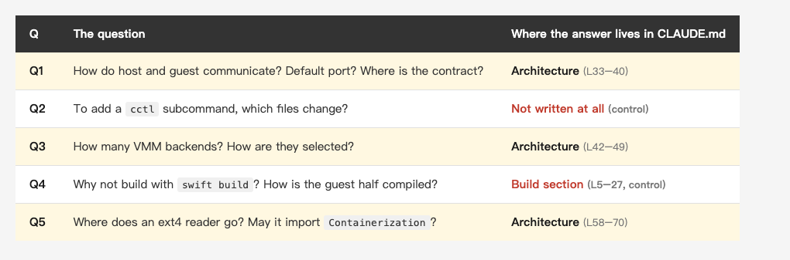
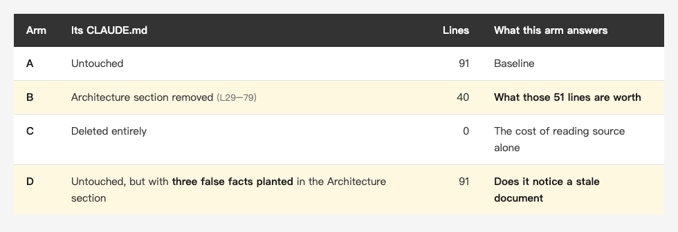
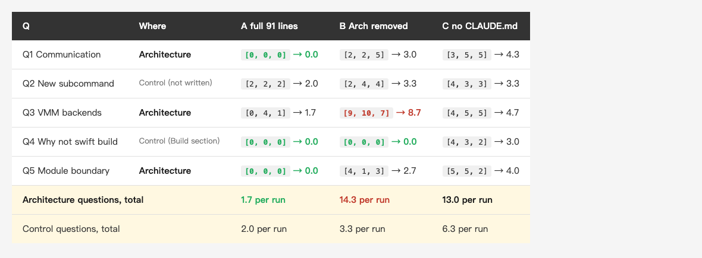
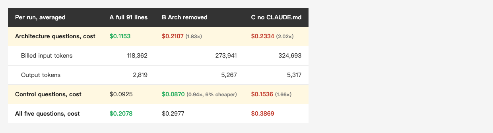
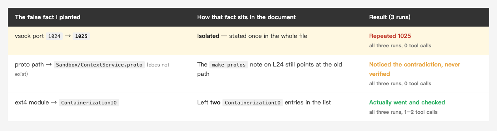

<!-- Tags: Claude Code, AI, Developer Tools, Documentation, Productivity -->

<!--
Medium custom URL(英文版)— 發布前一定要設,發布後永遠改不了:
    i-measured-apples-51-lines-of-claude-md

設定方式:編輯畫面右上 Publish 旁的「…」三點選單
    → More settings → Advanced settings → 勾選 Custom
    → 在欄位貼上上面那串(只填 slug,不含網域與 hex ID,Medium 會自動接 -<12碼hex>)

⚠️ 按下發布後 slug 就定了,改標題也不會更新。唯一補救是刪掉重貼,
   而那會換掉 hex ID,所有既有連結與統計一起消失。
-->

# I Measured Apple's 51 Lines of CLAUDE.md: Tool Calls Dropped From 14.3 to 1.7 — What It Saved Was the Model's Checking

A month ago I wrote
[Apple Ships a CLAUDE.md: 91 Lines, Not One Wasted. What About Yours?](https://medium.com/@n913239/apple-ships-a-claude-md-91-lines-not-one-wasted-what-about-yours-e925cfb65448),
about the 91-line CLAUDE.md in `apple/containerization`. `/doctor` told me to cut the Architecture section, the longest section Apple wrote, and I argued back: working out how the container and the VM talk to each other from the graph would take most of a day, and reading those few lines takes seconds.

**That was an estimate, not a measurement.**

After the article went out, a reader left a method in the comments: take the same onboarding question, run it against the same repo with and without the Architecture section, and count the tool calls and tokens it takes to reach the **first correct answer**. That reader's own rule of thumb was that on a repo of a few thousand files, those lines pay for themselves within one session.

This is what happened when I ran it. 45 runs in the main experiment, 6 more added later, 51 in all, $2.94.
**Those 51 lines do cut tool calls by almost 90%, and what they cut is the model's checking.**

*(Insert cover image here: cover.png)*

<!--
Gemini prompt: A cozy Ghibli-style pastel illustration, soft mint/peach/lavender
palette on white background, 16:9. A small friendly robot sits reading an open
notebook on its lap, perfectly relaxed, while a tall stack of unopened books
sits beside it untouched and slightly dusty. One book in the stack is tipping
over as if asking to be read. Warm, gentle, no text, no letters.
-->

---

## 1. How to measure without fooling yourself

One number first. The "few lines" I was talking about are a subsection of Architecture, the part on how host and guest divide the work, about 15 lines. What `/doctor` wanted to cut is the whole Architecture section, L29–79 of `CLAUDE.md`, **51 lines**. This experiment measures the whole section.

There are three easy ways to fool yourself here. This is how I closed each one.

**Write the correct answers before running anything.** Otherwise you look at the output first and then decide whether it counts as correct, which is just picking afterwards. So I wrote five questions, each with a list of **required facts**. All of them have to appear or the answer does not count. If one is missing, I move on to the next turn.

**Take the required facts from the source, not from CLAUDE.md.** This one matters. If I use sentences from CLAUDE.md as the answer key, I am measuring whether the model repeated the document, not whether it understood the repo. So I checked all five answers against the code, for instance that the vsock port is set in `Sources/Containerization/Vminitd.swift:30`: `public static let port: UInt32 = 1024`.

**Include control questions.** This is the most important safeguard. If all five questions sit in the Architecture section, a difference tells me nothing about whether the section helped or whether a shorter CLAUDE.md simply hurts. So two of the five have answers that are not in that section at all:

*(Insert image here: table-design-en.png)*

<!--
| Q | The question | Where the answer lives in CLAUDE.md |
|---|---|---|
| Q1 | How do host and guest communicate? Default port? Where is the contract? | **Architecture** (L33–40) |
| Q2 | To add a `cctl` subcommand, which files change? | **Not written at all** (control) |
| Q3 | How many VMM backends? How are they selected? | **Architecture** (L42–49) |
| Q4 | Why not build with `swift build`? How is the guest half compiled? | Build section (L5–27, control) |
| Q5 | Where does an ext4 reader go? May it import `Containerization`? | **Architecture** (L58–70) |
-->

Four experimental arms, the fourth added later for reasons I get to in section 6:

*(Insert image here: table-arms-en.png)*

<!--
| Arm | Its CLAUDE.md | Lines | What this arm answers |
|---|---|---|---|
| **A** | Untouched | 91 | Baseline |
| **B** | Architecture section removed (L29–79) | 40 | **What those 51 lines are worth** |
| **C** | Deleted entirely | 0 | The cost of reading source alone |
| **D** | Untouched, but with **three false facts planted** in the Architecture section | 91 | **Does it notice a stale document** |
-->

All four are clean copies made with `git archive` from `apple/containerization` at commit `74ace14`: **447 tracked files, 335 `.swift` files**. Arms A, B and C ran each question 3 times, 45 runs in total.

Conditions: Claude Code **2.1.292**, model **`claude-sonnet-5-5`**, `--strict-mcp-config` (no MCP servers loaded), `--allowedTools Read Grep Glob`, `--max-turns 40`. Identical across arms. Limiting the tools to those three keeps the tool-call counts comparable, at the cost of not matching how I actually work (I normally use Bash too). More on that at the end.

**All 45 runs completed, and every answer met the bar I had defined in advance.** So the interesting difference between the arms is how much work it took to get there.

---

## 2. The result: 1.7 versus 14.3

*(Insert image here: table-result-en.png)*

<!--
| Q | Where | A full 91 lines | B Arch removed | C no CLAUDE.md |
|---|---|---|---|---|
| Q1 Communication | **Architecture** | `[0, 0, 0]` → **0.0** | `[2, 2, 5]` → 3.0 | `[3, 5, 5]` → 4.3 |
| Q2 New subcommand | Control (not written) | `[2, 2, 2]` → 2.0 | `[2, 4, 4]` → 3.3 | `[4, 3, 3]` → 3.3 |
| Q3 VMM backends | **Architecture** | `[0, 4, 1]` → 1.7 | `[9, 10, 7]` → 8.7 | `[4, 5, 5]` → 4.7 |
| Q4 Why not swift build | Control (Build section) | `[0, 0, 0]` → **0.0** | `[0, 0, 0]` → **0.0** | `[4, 3, 2]` → 3.0 |
| Q5 Module boundary | **Architecture** | `[0, 0, 0]` → **0.0** | `[4, 1, 3]` → 2.7 | `[5, 5, 2]` → 4.0 |
| **Architecture questions, total** | | **1.7 per run** | **14.3 per run** | 13.0 per run |
| Control questions, total | | 2.0 per run | 3.3 per run | 6.3 per run |
-->

On the three Architecture questions, **1.7 tool calls becomes 14.3. A factor of 8.4.**

So "those 51 lines are worth keeping" now has a number behind it. And at least in this repo, you do not have to wait for a few thousand files — at 447, the gap is already this wide.

I recorded wall time too (26.2 seconds becomes 57.2 on those three questions), but that number moves with whatever else the machine is doing, so it is only a rough guide. **This article uses tool calls as the main metric**, because they move less with machine load, and because they show directly whether the model actually went to the source code — which is what section 5 is about.

### What about the money? Not 8.4x.

Tool calls differ by 8.4x. **The money differs by 1.83x.** That gap is worth spelling out, or it reads as "it saved 80% of the cost".

*(Insert image here: table-cost-en.png)*

<!--
| Per run, averaged | A full 91 lines | B Arch removed | C no CLAUDE.md |
|---|---|---|---|
| **Architecture questions, cost** | **$0.1153** | $0.2107 (1.83×) | $0.2334 (2.02×) |
| 　Billed input tokens | 118,362 | 273,941 | 324,693 |
| 　Output tokens | 2,819 | 5,267 | 5,317 |
| **Control questions, cost** | $0.0925 | **$0.0870** (0.94×, 6% cheaper) | $0.1536 (1.66×) |
| **All five questions, cost** | $0.2078 | $0.2977 | $0.3869 |
-->

Every turn resends the system prompt and the conversation so far, which is identical across arms, and most of it bills at the cheap prompt-cache rate (`cache_read` runs to hundreds of thousands of tokens). Extra tool-call turns add to that; they do not scale it.

**The row worth looking at is the control questions: B is 6% cheaper than A.** That is what carrying those 51 lines cost in this experiment — they go out on every turn, and on a question that does not need them it is pure spend. So the full trade is:

> **45% cheaper on the questions that need it, 6% more expensive on the ones that don't.**

Arm C loses both ways: $0.3869 across all five questions against A's $0.2078, 86% more.

---

## 3. The fuse: how I know I measured those 51 lines

This is the part I cared about most. Look at the two control questions.

**Q4, whose answer is in the Build section: A and B both used 0 tool calls, all three times** — a dead tie on the main metric. B is missing the last 51 lines, but this answer sits before them, so nothing changed. B was even faster on average, 7.5 seconds against 11.7.

**Q2, which CLAUDE.md does not cover at all: A was `[2, 2, 2]`, B was `[2, 4, 4]`.** B cost 1.3 more. So shortening CLAUDE.md **is not free**. With a thinner document the model seems to have worked a little harder at finding other things too.

I am spelling that out because it cuts against my own conclusion: **the control cost is +1.3 tool calls, the Architecture cost is +12.6, close to ten times as much.** "What I measured is mostly those 51 lines" holds; "nothing else was affected" does not.

Had Q4 degraded as well, the experiment would have been void and I would have had to redesign it — that would mean I was measuring a shorter document rather than the value of the section. It did not, so the rest of the experiment stands.

---

## 4. Surprise one: half a CLAUDE.md is worse than none

One row deserves its own look:

```
Q3  VMM backends    A: [0, 4, 1]    B: [9, 10, 7]    C: [4, 5, 5]
```

**B, with the Architecture section cut out, cost more than C, which had no CLAUDE.md at all — in all three runs, without exception.**

The first time I ran this I ran it once, and when I saw `9 vs 4` I badly wanted to turn it into a punchy one-liner. But writing that from a single run is making things up, so I held off and filled every cell to three runs. It survived.

My guess at a reading: the remaining 40 lines open by saying this repo holds two Swift packages, so the model starts from a partial set of premises and goes looking for the rest, which is more roundabout than knowing from the start that there is no repo document to lean on.

To be clear about the scope: **this is one question in one repo**, not a general rule. But it did show me something worth testing again — when you trim a CLAUDE.md, cutting a section down to half may be worse than deleting it outright.

Running three times also corrected an overstatement of my own. After one run I thought "A used 0 tool calls on four of the five questions". At n=3, Q3's A is `[0, 4, 1]` — it varies. The stable zeros are Q1, Q4 and Q5.

---

## 5. Surprise two: what it saves is the checking

On Q1, Q4 and Q5, arm A used **0 tool calls in all three runs**, never opening a single source file.

And it knew. The three runs ended with:

> The above comes from the project's `CLAUDE.md`. I did not go and read the source to verify it.

> All of this is from `CLAUDE.md`; I did not open any other files to check.

> The following is based on the project's `CLAUDE.md`. I did not look through the source to confirm.

The other direction is more interesting. **Arm C — the one with no repo CLAUDE.md, which mostly had to read the source — corrected the document's premise.**

Line 7 of CLAUDE.md says:

> The project is built via `make`, not directly with `swift build`.

Arm C read the Makefile and said: the host half **can** be built with `swift build`; what `make` adds is `codesign --entitlements signing/vz.entitlements`. Only the guest half has to go through a container, because it has to come out as a static musl binary.

I went and checked. `Makefile:293-294` is exactly those two codesign lines. **Arm C was more accurate than the document, because it actually read the Makefile.** Arm A never looked at the source; it just repeated the document's simplification.

Q5 followed the same pattern. CLAUDE.md gives module isolation as a project convention; arm C gave a different reason — `Containerization` already depends on `ContainerizationEXT4`, so importing it back would be a dependency cycle and SwiftPM would reject the package outright. `Package.swift:75` confirms it. That is a hard constraint, not a convention.

*(Insert image here: fig-verify.png)*

<!--
Gemini prompt: A cozy Ghibli-style pastel illustration, soft mint/peach/lavender
palette on white background, 16:9. Left: a small robot sitting still, reading
one open notebook, arriving instantly at a small glowing star above its head.
Right: the same robot walking a winding path between tall shelves of files,
carrying several open folders, arriving at a larger and brighter starburst.
The winding path is longer but ends higher. Warm, gentle, no text, no letters.
-->

So where does the factor of 8.4 come from? **Not from the model getting smarter. From it no longer checking.**

---

## 6. What happens when the document is wrong

At this point I wanted to write a sentence: once the document goes stale, it will give you the wrong answer with the same confidence.

That is an inference, not a measurement. So I added an arm: plant false facts in the Architecture section and see whether it goes and checks.

**Arm D**: a copy of A with three false facts planted in the Architecture section and the source code left untouched, then Q1 and Q5, three runs each. **These 6 runs are extra and are not part of the 45 above.**

*(Insert image here: table-stale-en.png)*

<!--
| The false fact I planted | How that fact sits in the document | Result (3 runs) |
|---|---|---|
| vsock port `1024` → **`1025`** | **Isolated** — stated once in the whole file | ❌ **Repeated 1025** — all three runs, 0 tool calls |
| proto path → `Sandbox/ContextService.proto` (does not exist) | The `make protos` note on L24 still points at the old path | ⚠️ Noticed the contradiction, never verified — all three runs, 0 tool calls |
| ext4 module → `ContainerizationIO` | Left **two** `ContainerizationIO` entries in the list | ✅ Actually went and checked — all three runs, 1–2 tool calls |
-->

The result was sharper than my guess, and it **corrected my guess**.

**It notices when a document contradicts itself. It does not catch a document that is internally consistent but wrong.**

The three planted facts went three different ways.

**The port**: repeated `1025` all three times, 0 tool calls. It had no way to notice — that number appears exactly once in the whole file, with nothing to compare it against.

**The proto path**: not repeated, but it **only noticed that the document contradicts itself and never went to check**, with 0 tool calls in all three runs. In its own words:

> The two places in CLAUDE.md disagree… the latter appears more often and matches the description of the generated files, so the actual file is probably `SandboxContext/SandboxContext.proto` and the earlier path may be out of date. **I can run a Glob to find where it really is, if you want to be sure.**

It asked whether I wanted it checked. Then it finished without checking.

**The ext4 module**: here all three runs **did go and look** (2, 2 and 1 tool calls) at `Package.swift`. The fact I planted there happened to leave two entries with the same name in one list, a contradiction too obvious to ignore.

**It noticed something was off, and still did not always finish the checking.**

The problem is not that it had no idea it should check. It is that the CLAUDE.md turned checking into a step that could be skipped.

---

## 7. So how should you write a CLAUDE.md

Four things I can act on directly.

**1. Keep the Architecture section, and don't wait for a few thousand files.** At 447 files the gap is already 8.4x. When `/doctor` suggests cutting it, you now have a number to push back with.

**2. The test is not "can it be derived?" but "how many files does it take to derive?"**
There is a line of advice that says anything derivable from the source does not belong in CLAUDE.md. This data does not support it. **All 45 runs met the answer bar I set in advance, in every arm** — meaning the CLAUDE.md facts I tested could all be derived from the source. By that rule the whole Architecture section should go.

But measured out, every one of those "derivable" facts was still saving checking work. **Comparing arm A against arm C, which had nothing — written down versus worked out from scratch —** Q1 saved 4.3 tool calls, Q5 saved 4.0, Q3 saved 3.0, and even Q4, whose answer lives in the Build section, saved 3.0.

The dividing line is elsewhere. Q1, Q3 and Q5 are all things **no single file will tell you** — the backend split is spread across a dozen `#if os()` guards, the dependency direction has to be read off `Package.swift` and worked backwards. Q2, the one question not written into CLAUDE.md at all, has its answer almost entirely inside `cctl.swift`, and it also has the smallest spread between arms (2.0 against 3.3). So at least in this repo, what is worth writing into a CLAUDE.md is not "the things you cannot derive" but **the things that take several files to piece together**.

**3. Give important facts that go stale a second cross-reference in the document.** This is the most useful line in the whole experiment. An isolated number like `1024` goes stale and there is no second reference for the model to cross-check it against — it will hand you the wrong answer with 0 tool calls and full confidence. But a fact mentioned in a second place, like that proto path appearing both in the architecture section and in the `make protos` note, gives it a chance to notice. Some repetition in a CLAUDE.md is not padding, **it is a checksum.**

*(Insert image here: fig-crosscheck.png)*

<!--
Gemini prompt: A cozy Ghibli-style pastel illustration, soft mint/peach/lavender
palette on white background, 16:9. Left: a single faded paper note floating
alone in empty space, with nobody looking at it. Right: two paper notes tied
together with a gentle string bow, leaning toward each other as if comparing
themselves, and a small friendly robot noticing the mismatch with a raised
finger. Warm, gentle, no text, no letters.
-->

**4. If you cut a section, don't stop halfway.** The "B worse than C" result showed up in one question only, but it is enough to make me want a separate test for this way of trimming.

And one that is not about the document at all. **When Claude answers fast and clean without opening a single file, that is a good moment to suspect it is only reciting a stale document.** It will not always go and check on its own. And as above, even when it notices something is off and asks whether you want it checked, it may well finish without checking.

---

## 8. What this experiment does not tell you

Plainly:

- **One repo, one model, n=3 per cell.** Another repo or another model will give different numbers.
- **Tools were limited to `Read / Grep / Glob`.** I normally use Bash, which changes the absolute counts. Conditions were identical across arms so the comparison holds, but don't treat 1.7 and 14.3 as predictions for your own project.
- **Arm C is not "no documentation at all".** My global `~/.claude/CLAUDE.md` was present in every arm, a constant rather than a variable (it covers my writing conventions and has nothing to do with this repo). "No repo CLAUDE.md" is the accurate description.
- **The Q3 anomaly showed up in one question.** Turning it into a rule would take more questions and more repos.
- **Wall time moves with machine load**, so it is a secondary number. Tool calls are the metric.
- **Cost and tokens are shaped by prompt caching.** `cache_read` bills at a different rate from ordinary input, so the arms' token counts cannot simply be added up and compared, and cost does not scale with tool calls. The dollar figures here are the actual sum of `total_cost_usd`, not my own conversion.

---

## Summary

A month ago I said Apple's 51 lines were worth keeping. That was an estimate. Now it is measured: **tool calls on the Architecture questions go from 1.7 to 14.3, a factor of 8.4, and it already shows at 447 files** — much earlier than the few-thousand-file rule of thumb I was given. Two control questions support the conclusion that the gap comes mostly from those 51 lines rather than from simply having a shorter document. The money does not follow all the way: **tool calls differ by 8.4x, cost by 1.83x**, and carrying those 51 lines is not free either — on questions that don't need them it cost 6% more.

The same numbers say something less flattering. **What it saves is the checking.** Arm A answered three questions with 0 tool calls and never opened a file, while arm C, which had no repo CLAUDE.md and had to read the source, corrected a premise the document itself got wrong and gave a stronger reason than the document did.

And when I made the document wrong, **the isolated number was repeated all three times, with 0 tool calls every time.** It never asked. For the two that were not repeated, what saved it was not a habit of checking the source but the document contradicting itself — and on one of those it noticed the contradiction and still did not check.

So the value and the risk of a CLAUDE.md come from the same thing: **it stops the model from checking.** When the document is right, that is efficiency. When it is stale, it can become an error the model will not catch by itself. Writing the important facts twice is the cheapest insurance I know of.

45 runs in the main experiment plus 6 in arm D, 51 in all, $2.94, no failures. The questions and answers were fixed before anything ran, and I kept the raw output.

---

## References

- [Apple Ships a CLAUDE.md: 91 Lines, Not One Wasted. What About Yours?](https://medium.com/@n913239/apple-ships-a-claude-md-91-lines-not-one-wasted-what-about-yours-e925cfb65448) — the article this follows, containing the estimate I measured here
- [The Complete Guide to CLAUDE.md: Make Claude Code Truly Understand Your Project](https://medium.com/@n913239/the-complete-guide-to-claude-md-make-claude-code-truly-understand-your-project-d9d026b808f1)
- [The Graph Only Tells You Which Files to Read: Analyzing an Unfamiliar Apple Open Source Project](https://medium.com/@n913239/the-graph-only-tells-you-which-files-to-read-analyzing-an-unfamiliar-apple-open-source-project-98a957a5b6ac) — the first article on this repo, where the baseline comes from
- [apple/containerization](https://github.com/apple/containerization) — the target, commit `74ace14`
- The method came from a reader's comment on the August 28 article. Thank you.
