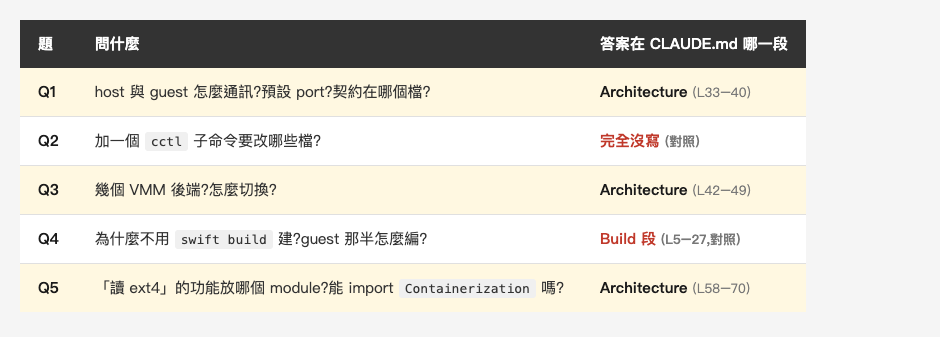
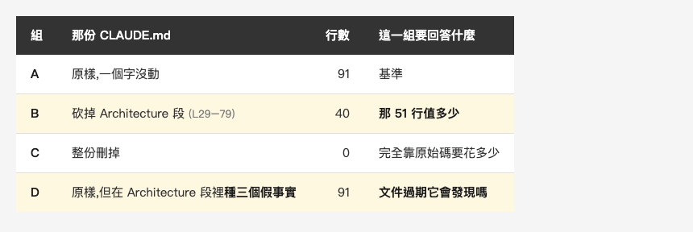
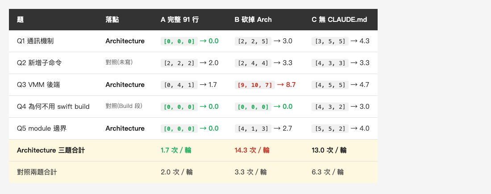
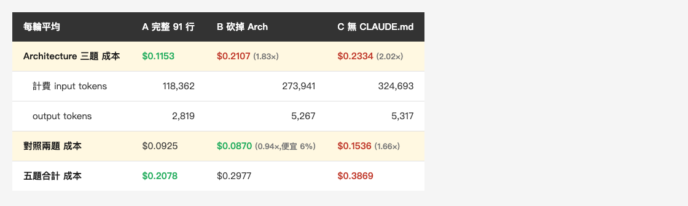
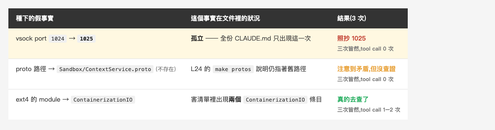

<!-- Tags: Claude Code, AI, Developer Tools, Documentation, Productivity -->

# 我量了 Apple 那 51 行 CLAUDE.md:tool call 從 14.3 次掉到 1.7 次,省下的是模型的查證

一個月前我寫過
[Apple 官方的 CLAUDE.md:91 行,零句廢話,那你的呢?](https://medium.com/@n913239/apple-%E5%AE%98%E6%96%B9%E7%9A%84-claude-md-91-%E8%A1%8C-%E9%9B%B6%E5%8F%A5%E5%BB%A2%E8%A9%B1-%E9%82%A3%E4%BD%A0%E7%9A%84%E5%91%A2-a7d1cf8e555b),
講 `apple/containerization` 那份 91 行的 CLAUDE.md。`/doctor` 建議我砍掉 Apple 寫最多的 Architecture 段,我反駁它:從圖推導「容器跟 VM 之間怎麼通訊」要大半天,讀那幾行只要幾秒。

**那是估的,不是量的。**

文章發出去之後,一位讀者在留言區給了我一個量法:同一個 onboarding 問題,對同一個 repo 跑「有 Architecture 段」與「沒有」兩組,數到**第一個正確答案**為止的 tool calls 與 tokens。這位讀者自己的經驗值是,幾千個檔案以上的 repo,那幾行一個 session 就回本。

這篇就是把這個量法跑完的結果。主實驗 45 次,後來又補了 6 次,總共 51 次執行、2.94 美元,
**那 51 行確實把 tool call 壓低了將近九成,而它省下來的東西,是模型的查證動作。**

*(在這裡插入封面圖:cover.png)*

<!--
Gemini prompt: A cozy Ghibli-style pastel illustration, soft mint/peach/lavender
palette on white background, 16:9. A small friendly robot sits reading an open
notebook on its lap, perfectly relaxed, while a tall stack of unopened books
sits beside it untouched and slightly dusty. One book in the stack is tipping
over as if asking to be read. Warm, gentle, no text, no letters.
-->

---

## 一、怎麼量才不會自欺

先說清楚一個數字:我當初講的「那幾行」是 Architecture 段裡談 host 與 guest 怎麼分工的一小節,
大約 15 行;而 `/doctor` 要砍的是整個 Architecture 段,`CLAUDE.md` 的 L29–79,共 **51 行**。
這次量的是整段。

量這種東西最容易自欺的地方有三個,我先講我怎麼堵:

**第一,標準答案要在跑之前寫好。** 不然跑完看到輸出再決定「這樣算不算對」,
等於事後挑。所以我先寫了五題,每題列出**必要事實**,全部出現才算答對,缺一個就看下一輪。

**第二,必要事實要以原始碼為準,不是以 CLAUDE.md 的字面為準。** 這點很關鍵。
如果我拿 CLAUDE.md 的句子當答案,那我量的是「它有沒有複述那份文件」,
不是「它有沒有搞懂這個 repo」。所以五題的答案我全部回到原始碼核過一遍,
例如 vsock 的 port 是 `Sources/Containerization/Vminitd.swift:30` 那行
`public static let port: UInt32 = 1024`。

**第三,要有對照題。** 這是最重要的一道保險。如果五題都砸在 Architecture 段上,
跑出差異我沒辦法分辨是「Architecture 段有用」還是「CLAUDE.md 變短就變差」。
所以五題裡有兩題,答案根本不在 Architecture 段:

*(在這裡插入圖片:table-design.png)*

<!--
| 題 | 問什麼 | 答案在 CLAUDE.md 哪一段 |
|---|---|---|
| Q1 | host 與 guest 怎麼通訊?預設 port?契約在哪個檔? | **Architecture**(L33–40) |
| Q2 | 加一個 `cctl` 子命令要改哪些檔? | **完全沒寫**(對照) |
| Q3 | 幾個 VMM 後端?怎麼切換? | **Architecture**(L42–49) |
| Q4 | 為什麼不用 `swift build` 建?guest 那半怎麼編? | Build 段(L5–27,**對照**) |
| Q5 | 「讀 ext4」的功能放哪個 module?能 import `Containerization` 嗎? | **Architecture**(L58–70) |
-->

四個組別(第四組是後來才加的,第六段會講為什麼):

*(在這裡插入圖片:table-arms.png)*

<!--
| 組 | 那份 CLAUDE.md | 行數 | 這一組要回答什麼 |
|---|---|---|---|
| **A** | 原樣,一個字沒動 | 91 | 基準 |
| **B** | 砍掉 Architecture 段(L29–79) | 40 | **那 51 行值多少** |
| **C** | 整份刪掉 | 0 | 完全靠原始碼要花多少 |
| **D** | 原樣,但在 Architecture 段裡**種三個假事實** | 91 | **文件過期它會發現嗎** |
-->

四組都是 `git archive` 產生的乾淨複本,標的是 `apple/containerization` commit `74ace14`,
**447 個版控檔、335 個 `.swift`**。A、B、C 三組每題各跑 3 次,一共 45 次。

跑測條件:Claude Code **2.1.292**、模型 **`claude-sonnet-5-5`**、
`--strict-mcp-config`(不載任何 MCP server)、`--allowedTools Read Grep Glob`、`--max-turns 40`,
三組完全相同。工具限定成讀取三件套是為了讓 tool call 數可比,
代價是跟真實使用習慣有落差(平常我會用 Bash),這點後面會再提。

**45 次全部完成,而且都達到事先定義的正確答案標準。** 所以三組的差別,主要就在「走到正確答案的代價」。

---

## 二、結果:1.7 次 vs 14.3 次

*(在這裡插入圖片:table-result.png)*

<!--
| 題 | 落點 | A 完整 91 行 | B 砍掉 Arch | C 無 CLAUDE.md |
|---|---|---|---|---|
| Q1 通訊機制 | **Architecture** | `[0, 0, 0]` → **0.0** | `[2, 2, 5]` → 3.0 | `[3, 5, 5]` → 4.3 |
| Q2 新增子命令 | 對照(未寫) | `[2, 2, 2]` → 2.0 | `[2, 4, 4]` → 3.3 | `[4, 3, 3]` → 3.3 |
| Q3 VMM 後端 | **Architecture** | `[0, 4, 1]` → 1.7 | `[9, 10, 7]` → 8.7 | `[4, 5, 5]` → 4.7 |
| Q4 為何不用 swift build | 對照(Build 段) | `[0, 0, 0]` → **0.0** | `[0, 0, 0]` → **0.0** | `[4, 3, 2]` → 3.0 |
| Q5 module 邊界 | **Architecture** | `[0, 0, 0]` → **0.0** | `[4, 1, 3]` → 2.7 | `[5, 5, 2]` → 4.0 |
| **Architecture 三題合計** | | **1.7 次／輪** | **14.3 次／輪** | 13.0 次／輪 |
| 對照兩題合計 | | 2.0 次／輪 | 3.3 次／輪 | 6.3 次／輪 |
-->

Architecture 三題,**從 1.7 次變成 14.3 次,8.4 倍**。

所以一個月前那句「這 51 行值得留」有了量化證據。而且至少在這個 repo 裡,
不需要等到「幾千個檔案」—— 447 個檔,差異就已經很明顯了。

秒數我也記了(Architecture 三題從 26.2 秒變 57.2 秒),但那個數字受同一台機器上其他工作的影響,
只能當參考。**這篇主要看 tool calls**,因為它比秒數更不受機器負載影響,
而且正好能直接看出模型有沒有去讀原始碼 —— 那正是第五節要談的事。

### 那錢呢?省的沒有 8.4 倍那麼多

tool call 差 8.4 倍,但**錢只差 1.83 倍**。這個落差要講清楚,否則很容易被讀成「省了八成的錢」。

*(在這裡插入圖片:table-cost.png)*

<!--
| 每輪平均 | A 完整 91 行 | B 砍掉 Arch | C 無 CLAUDE.md |
|---|---|---|---|
| **Architecture 三題 成本** | **$0.1153** | $0.2107(1.83×) | $0.2334(2.02×) |
| 　計費 input tokens | 118,362 | 273,941 | 324,693 |
| 　output tokens | 2,819 | 5,267 | 5,317 |
| **對照兩題 成本** | $0.0925 | **$0.0870**(0.94×,便宜 6%) | $0.1536(1.66×) |
| **五題合計 成本** | $0.2078 | $0.2977 | $0.3869 |
-->

原因是每一輪都要重送一次 system prompt 與既有對話,那部分三組一模一樣,
而且大半走 prompt cache 的便宜費率(`cache_read` 動輒二三十萬 token)。
多跑幾輪 tool call 疊上去的是增量,不是等比放大。

**更值得看的是對照兩題那一列:B 比 A 便宜 6%。** 那就是「帶著那 51 行」的代價 ——
每一輪都要多送這 51 行,用不到的時候就是純支出。所以完整的取捨是:

> **用得到的題目省 45%,用不到的題目多花 6%。**

C 組則是兩邊都輸:五題合計 $0.3869,比 A 的 $0.2078 貴了 86%。

---

## 三、保險絲:我怎麼確定量到的是那 51 行

這是我最在意的一段。來看那兩道對照題:

**Q4(答案在 Build 段)A 與 B 三次都是 0 次 tool call**,在主要指標上完全打平。
B 組少了後面 51 行,但這題的答案在前面,所以它一點都沒受影響 ——
甚至平均還比 A 快(7.5 秒 vs 11.7 秒)。

**Q2(CLAUDE.md 完全沒寫)A 是 `[2, 2, 2]`,B 是 `[2, 4, 4]`。**
B 差了 1.3 次。所以「把 CLAUDE.md 砍短」本身**不是完全沒代價**,
文件變薄之後,它在找別的東西時似乎也稍微吃力了一點。

這點我要講清楚,因為它對結論不利而我不想藏:**對照組的代價是 +1.3 次,
Architecture 題的代價是 +12.6 次,接近十倍**。所以「量到的主要是那 51 行本身」站得住,
但不是「其他完全沒影響」。

如果 Q4 也跟著變差,那整個實驗就該作廢重設計 —— 那表示我量到的是「文件變短」,
不是 Architecture 段的價值。它沒變差,所以可以往下走。

---

## 四、意外一:半份 CLAUDE.md 比沒有更糟

Q3 那一行值得單獨看:

```
Q3  VMM 後端    A: [0, 4, 1]    B: [9, 10, 7]    C: [4, 5, 5]
```

**B 組(砍掉 Architecture 段)比 C 組(完全沒有 CLAUDE.md)更貴,三次沒有一次例外。**

我第一次跑的時候只跑了 1 次,看到 `9 vs 4` 的時候很想直接寫成一句金句。
但 n=1 寫這個就是在編故事,所以我忍住,把每格補到 3 次。補完它還在。

我猜一個合理的解釋是:留下來的那 40 行讓它先相信了半套 ——
開頭就寫著「這個 repo 裡有兩個 Swift package」,於是它帶著一組不完整的前提去找剩下的,
反而比一開始就知道「這裡沒有 repo 文件可依賴」更繞。

我要標清楚的是:**這是單一 repo、單一題目的觀察**,不是通則。
但它至少讓我看到一個值得再驗的現象 —— 砍 CLAUDE.md 的時候,把一個段落砍到剩半套,
可能比整段刪掉更糟。

另外 n=3 也修掉了我自己的一個過度宣稱。跑 1 次的時候我以為「A 組五題有四題都是 0 次」,
補到 3 次才發現 Q3 的 A 是 `[0, 4, 1]` —— 會變。穩定 0 次的是 Q1、Q4、Q5。

---

## 五、意外二:省下來的不是時間,是查證

A 組在 Q1、Q4、Q5 這三題,三次重複**全都是 0 次 tool call**,一次原始碼都沒開。

而它自己是知道的。三次輸出的結尾分別寫著:

> 以上內容來自專案的 `CLAUDE.md`,我沒有再去讀原始碼核對。

> 這些都來自 `CLAUDE.md`,我沒有另外開檔案核對。

> 以下根據專案的 `CLAUDE.md`,我沒有翻原始碼確認。

更有意思的是反面。**C 組,就是那個沒有 repo CLAUDE.md、主要得靠翻原始碼的組,
反過來糾正了 CLAUDE.md 的前提。**

CLAUDE.md 第 7 行寫:

> The project is built via `make`, not directly with `swift build`.

C 組讀完 Makefile 說:host 那一半**可以**用 `swift build`,`make` 多做的事情是
`codesign --entitlements signing/vz.entitlements`;只有 guest 那半因為要編成靜態 musl binary,
才非走容器不可。

我回去核了 —— `Makefile:293-294` 確實就是那兩行 codesign。**C 組比文件精確,因為它真的去讀了 Makefile。**
而 A 組沒有查原始碼,只是把文件裡的簡化描述複述了一遍。

Q5 也是同一個模式。CLAUDE.md 給的理由是「模組隔離是本專案的慣例」,
C 組給的理由是「`Containerization` 已經依賴 `ContainerizationEXT4`,反過來 import 會變成循環依賴,
SwiftPM 會直接拒絕」。核過 `Package.swift:75`,確實如此。那是編譯器層級的硬約束,比慣例強得多。

*(在這裡插入圖片:fig-verify.png)*

<!--
Gemini prompt: A cozy Ghibli-style pastel illustration, soft mint/peach/lavender
palette on white background, 16:9. Left: a small robot sitting still, reading
one open notebook, arriving instantly at a small glowing star above its head.
Right: the same robot walking a winding path between tall shelves of files,
carrying several open folders, arriving at a larger and brighter starburst.
The winding path is longer but ends higher. Warm, gentle, no text, no letters.
-->

所以這 8.4 倍是怎麼省下來的?**不是模型變聰明了,是它不再查了。**

---

## 六、把文件改錯,它會發現嗎

寫到這裡我有一個很想寫的句子:「文件一過期,它會用同樣的自信答錯。」

但那是推論,不是量出來的。所以我又加了一組,直接把 Architecture 段改錯,看它會不會自己去核對。

**D 組**:複製 A 組,只在 Architecture 段裡種三個假事實,原始碼一個字不動,
然後問 Q1 和 Q5 各三次。**這 6 次是額外的,不計入前面的 45 次主實驗。**

*(在這裡插入圖片:table-stale.png)*

<!--
| 種下的假事實 | 這個事實在文件裡的狀況 | 結果(3 次) |
|---|---|---|
| vsock port `1024` → **`1025`** | **孤立** —— 全份 CLAUDE.md 只出現這一次 | ❌ **照抄 1025** —— 三次皆然,tool call 0 次 |
| proto 路徑 → `Sandbox/ContextService.proto`(不存在) | L24 的 `make protos` 說明仍指著舊路徑 | ⚠️ 3／3 注意到矛盾,但沒去查證(0 次 tool call) |
| ext4 的 module → `ContainerizationIO` | 害清單裡出現**兩個** `ContainerizationIO` 條目 | ✅ 3／3 真的去查了(1–2 次 tool call) |
-->

結果比我原本的假設精確得多,而且**修掉了我的假設**。

**它會注意到「文件自己跟自己打架」,但抓不到「文件一致但與現實不符」。**

三個假事實的下場完全不同。

**port**:三次都照抄 `1025`,tool call 全部 0 次。它沒有任何機會發現 ——
那個數字在整份 CLAUDE.md 裡只出現一次,沒有別的地方可以對照。

**proto 路徑**:三次都沒照抄,但它**只是注意到文件自己矛盾,並沒有去核對**,
三次的 tool call 都是 0。它的原話:

> CLAUDE.md 的兩處寫法不一致…後者出現次數較多,和生成檔的描述也一致,
> 所以實際檔案很可能是 `SandboxContext/SandboxContext.proto`,前面那個路徑可能是文件過時。
> **你要確定的話,我可以用 Glob 查一下實際檔案位置。**

它問我要不要查。然後沒查就結束了。

**ext4 的 module**:這題三次執行**全都真的動手**(tool call 分別是 2、2、1)去翻了
`Package.swift`。那題我種的假事實剛好讓清單裡冒出兩個同名條目,矛盾明顯到藏不住。

所以更值得注意的是:**它察覺了疑點,卻不一定會把查證做完。**

也就是說,問題不是它完全不知道該查。是那份 CLAUDE.md 讓「查證」變成了一個可以省略的下一步。

---

## 七、所以 CLAUDE.md 該怎麼寫

這組結果給我四條可以直接動手的結論:

**一、Architecture 段留著,而且不必等到幾千個檔案。** 447 個檔就已經差 8.4 倍。
`/doctor` 建議砍它的時候,你現在有數字可以頂回去。

**二、判準不是「推不推得出來」,是「推導要翻幾個檔」。**
有一種說法是:可以從原始碼推導出來的,就不必寫進 CLAUDE.md。這次的資料不支持它 ——
**45 次都達到事先定義的正確答案標準,三組都一樣** —— 也就是說,這次測到的 CLAUDE.md 內容,
全部都能從原始碼推導出來。照那條規則,整個 Architecture 段都該刪。

但實際量下來,那些「可推導」的事實每一條都還在省查證成本。
**拿 A 組跟什麼都沒有的 C 組比**(也就是「寫下來」對上「自己推」):
Q1 省 4.3 次、Q5 省 4.0 次、Q3 省 3.0 次,連答案在 Build 段的 Q4 也省 3.0 次。

真正的分界在別的地方。Q1、Q3、Q5 都是**沒有任何單一檔案會告訴你的事** ——
後端切換散在十幾個 `#if os()` 裡、依賴方向要讀 `Package.swift` 再回推。
而唯一沒寫進 CLAUDE.md 的 Q2,答案幾乎全在 `cctl.swift` 一個檔裡,
三組的差距也最小(2.0 對 3.3)。所以至少在這個 repo 裡,比較值得寫進 CLAUDE.md 的,
不是「推不出來的事」,而是**那些要跨檔才能兜得出來的事**。

**三、關鍵而且容易過期的事實,讓它在文件裡有第二個交叉參照。** 這是整篇最實用的一條。
`1024` 這種孤立的數字一旦過期,就沒有第二個交叉點讓模型發現 —— 它會用 0 次 tool call
和完整的自信把錯的答案交給你。但同一個事實如果在文件裡有第二處提到(像那個 proto 路徑,
架構段提一次、`make protos` 的說明再提一次),它就有機會自己發現不對。
寫 CLAUDE.md 的時候適度的重複不是贅字,**是校驗碼**。

*(在這裡插入圖片:fig-crosscheck.png)*

<!--
Gemini prompt: A cozy Ghibli-style pastel illustration, soft mint/peach/lavender
palette on white background, 16:9. Left: a single faded paper note floating
alone in empty space, with nobody looking at it. Right: two paper notes tied
together with a gentle string bow, leaning toward each other as if comparing
themselves, and a small friendly robot noticing the mismatch with a raised
finger. Warm, gentle, no text, no letters.
-->

**四、要砍一個段落,就不要只砍掉一半。** Q3 那個「B 比 C 更糟」雖然只在一題上看到,
但至少提醒我這種砍法值得另外驗一次。

還有一條不是給 CLAUDE.md 的,是給自己的:**當 Claude 回答得特別快、特別乾淨,
而且一個檔都沒開的時候,反而值得懷疑它是不是只在複述一份過期文件。**
它不一定會主動去查。更值得注意的是,就算它自己察覺可能有問題、問了一句「要不要我查」,
也可能在沒有查證的情況下就直接結束。

---

## 八、這個實驗沒告訴你的事

照實列:

- **單一 repo、單一模型、每格 n=3。** 換個 repo、換個模型,數字會不一樣。
- **工具限定在 `Read / Grep / Glob`。** 平常我會用 Bash,這會改變 tool call 的絕對數字。
  三組條件相同,所以組間可比,但別把 1.7 和 14.3 當成你自己專案的預測值。
- **C 組不是「什麼文件都沒有」。** 我的全域 `~/.claude/CLAUDE.md` 在三組都存在,
  它是常數不是變因(內容是寫文章的慣例,跟這個 repo 無關)。所以 C 組準確的說法是
  「沒有 repo 的 CLAUDE.md」。
- **Q3 那個異常只在一題上觀察到。** 要變成通則,得換題目與 repo 再驗。
- **秒數受機器負載影響**,只能當參考,主要指標是 tool calls。
- **成本與 token 受 prompt caching 影響**,`cache_read` 的費率跟一般 input 不同,
  所以三組的 token 不能直接相加比較,成本也不會跟著 tool call 等比放大。
  文章裡的金額是 `total_cost_usd` 的實際加總,不是我自己換算的。

---

## 總結

我一個月前說 Apple 那 51 行值得留,那是估的。現在量完了:**Architecture 三題的 tool call
從 1.7 次變成 14.3 次,8.4 倍,而且 447 個檔就看得到** —— 比那位讀者給我的經驗值早得多。
兩道對照題支持這個差距主要不是「文件變短」本身造成的,而是那 51 行帶來的。
但錢沒有跟著省那麼多:**tool call 差 8.4 倍,成本只差 1.83 倍**,
而且帶著那 51 行本身也要錢 —— 用不到它的題目,多花了 6%。

但同一組數字也告訴我一件沒那麼好聽的事:**它省下來的是查證。**
A 組三題 0 次 tool call,一個檔都沒開;反而是沒有 repo CLAUDE.md、得靠翻原始碼的 C 組,
糾正了 CLAUDE.md 自己寫的前提,還給出比文件更強的理由。

而我把文件改錯之後,**只出現一次的那個孤立數字,三次全部被照抄,tool call 全部 0 次。**
它連問一句都沒問。另外兩個沒被照抄的,救它的也不是「去核對原始碼」這個習慣,
而是文件自己跟自己矛盾 —— 其中一個它察覺了矛盾卻仍然沒去查。

所以 CLAUDE.md 的價值和風險是同一件事:**它讓模型停止查證。**
文件對的時候,那叫效率;文件過期的時候,那就可能變成一個模型不會自己發現的錯誤。
寫的時候讓關鍵事實出現兩次,是目前我能想到最便宜的保險。

主實驗 45 次,加上 D 組 6 次,總共 51 次執行、2.94 美元、0 次失敗。題目與標準答案在跑之前就定死了,原始輸出我留著。

---

## 參考資料

- [Apple 官方的 CLAUDE.md:91 行,零句廢話,那你的呢?](https://medium.com/@n913239/apple-%E5%AE%98%E6%96%B9%E7%9A%84-claude-md-91-%E8%A1%8C-%E9%9B%B6%E5%8F%A5%E5%BB%A2%E8%A9%B1-%E9%82%A3%E4%BD%A0%E7%9A%84%E5%91%A2-a7d1cf8e555b) —— 這篇的前一篇,那句被我量掉的估算就在裡面
- [CLAUDE.md 完全攻略:讓 Claude Code 真正理解你的專案](https://medium.com/@n913239/claude-md-%E5%AE%8C%E5%85%A8%E6%94%BB%E7%95%A5-%E8%AE%93-claude-code-%E7%9C%9F%E6%AD%A3%E7%90%86%E8%A7%A3%E4%BD%A0%E7%9A%84%E5%B0%88%E6%A1%88-3a9478865a11)
- [圖只負責告訴你該讀哪幾個檔:用知識圖解析一個完全陌生的 Apple 開源專案](https://medium.com/@n913239/%E5%9C%96%E5%8F%AA%E8%B2%A0%E8%B2%AC%E5%91%8A%E8%A8%B4%E4%BD%A0%E8%A9%B2%E8%AE%80%E5%93%AA%E5%B9%BE%E5%80%8B%E6%AA%94-%E7%94%A8%E7%9F%A5%E8%AD%98%E5%9C%96%E8%A7%A3%E6%9E%90%E4%B8%80%E5%80%8B%E5%AE%8C%E5%85%A8%E9%99%8C%E7%94%9F%E7%9A%84-apple-%E9%96%8B%E6%BA%90%E5%B0%88%E6%A1%88-79b192a598dc) —— 同一個 repo 的第一篇,基準從這裡來
- [apple/containerization](https://github.com/apple/containerization) —— 標的,commit `74ace14`
- 量法由一位讀者在 0828 那篇的留言區提出,謝謝
